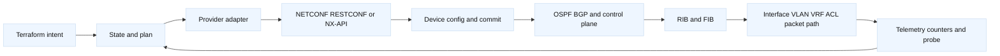
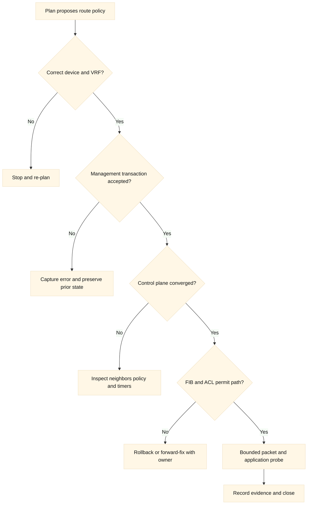
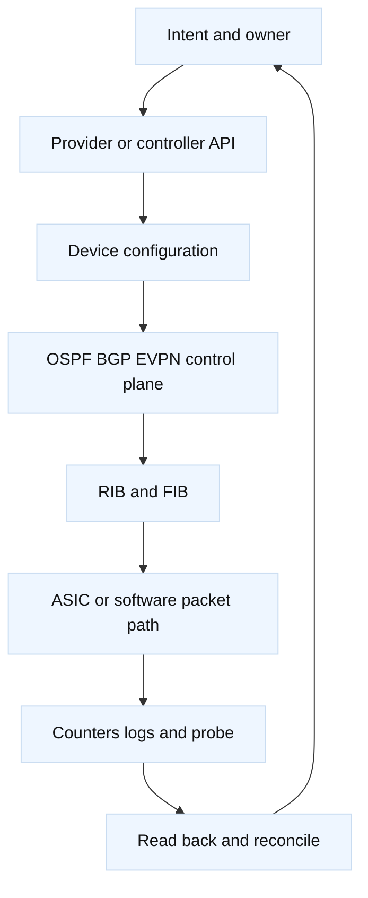

# 17. Cisco Networking and Terraform

## A. Learning objectives

This module explains how to prepare for Cisco networking and infrastructure-as-
code interviews without reducing a network operating system to a list of CLI
commands. You will connect interfaces, VLANs, VRFs, ACLs, OSPF, and BGP to a
packet path and then distinguish Terraform's declarative state from the device
configuration and forwarding state. You will compare IOS-XE and NX-OS control
surfaces, including NETCONF, RESTCONF, and NX-API, and explain when Terraform,
Ansible, Cisco NSO, or NDFC is the better ownership tool.

The central interview skill is boundary reasoning. Terraform can model a
device, interface, VLAN, routing policy, or controller object through a provider
or API adapter, but it does not replace the device's routing process, ASIC
forwarding pipeline, configuration database, or operational telemetry. A
successful commit or API response does not prove that OSPF converged, BGP chose
the intended path, an ACL permits the intended direction, or packets traverse
the expected VRF. **Fact:** exact resource schemas, endpoint paths, feature
support, transaction behavior, and defaults vary across IOS-XE, NX-OS, release,
platform, license, and provider.

## B. Prerequisites

Know Ethernet, trunks, access ports, VLAN tagging, IPv4/IPv6, VRFs, ACL match
order, OSPF adjacency, BGP policy, route selection, Terraform state and plan,
and basic Linux networking. Review [routing fundamentals](../book/02-addressing-subnetting-routing.md),
[BGP and multi-region reasoning](../book/16-bgp-anycast-and-multi-region.md),
[network troubleshooting](../docs/networking-issue-cheatsheets.md), and
[Terraform safe change](05-plan-apply-lifecycle-and-safe-change.md).

Use a virtual lab, containerized network emulator, or a disposable switch/router
with a non-production VRF. Never paste real device credentials, certificates,
running configuration, public addresses, or customer topology. API examples
use `example.invalid` and documentation ranges. Commands that change a device
are shown as patterns for a reviewed lab, not as an operational procedure.

### B.1 Versioned lab contract

**Lab contract v1.0 (illustrative, 2026-08):** record the exact IOS-XE or
NX-OS release, hardware or emulator image, provider/API version, Terraform
version, enabled features, and supported YANG models before planning. Use one
isolated VRF and disposable tenant VLAN. The minimum topology is a management
workstation, one router or IOS-XE switch, one NX-OS leaf when available, a test
endpoint, and a cloud-side test VPC/VPC network. If an emulator is used, label
hardware forwarding, ASIC counters, and licensing as unvalidated.

| Contract item | Required record | Evidence expected |
| --- | --- | --- |
| Device lane | IOS-XE direct, NX-OS direct, NDFC intent, or NSO service | One authoritative owner per object. |
| Capability | Transport, YANG modules, feature gates, candidate/commit support | Discovery output and release-specific documentation. |
| Scope | Device names, VRF/VLAN IDs, prefixes, ACL names, cloud attachment | Bounded blast radius and deterministic cleanup. |
| Verification | Adjacency, RIB/FIB, interface/ACL counters, probe, cloud logs | Evidence across management, control, data, and remote planes. |
| Recovery | Prior policy/config snapshot, traffic shift, owner, stop condition | Tested rollback or explicit forward-fix path. |

**Validated in lab:** only the selected device image and API feature set.
**Illustrative:** provider resource names and payloads in this module.
**Inference:** a controller boundary is usually preferable for multi-device
transactions, while direct Terraform can fit a small, tested device-owned set.

## C. Portable network and automation model

A Cisco change crosses at least five layers. Desired intent says what topology,
policy, or service should exist. Terraform configuration and state record the
declared resources and the provider's object mapping. The device management
plane accepts CLI, NETCONF, RESTCONF, or NX-API operations and may stage or
commit them. The control plane runs processes such as OSPF or BGP and builds a
RIB. The data plane programs hardware or software forwarding tables and applies
VLAN, VRF, ACL, and next-hop behavior. Telemetry, counters, logs, and packet
tests provide evidence across those layers.

The same interface name can exist in different ownership and forwarding
contexts. A VLAN may be configured but absent from the trunk. An SVI may be up
but in the wrong VRF. A BGP session may be established while an outbound policy
rejects all prefixes. A Terraform resource may be present in state while an
operator changed the device configuration outside Terraform. Interview answers
should name the layer being tested and the evidence that could falsify the
hypothesis.





## D. Cisco architecture: IOS-XE, NX-OS, and fabrics

| Concern | IOS-XE example | NX-OS example | Interview implication |
| --- | --- | --- | --- |
| Configuration model | Running/startup config and platform feature processes | Running configuration plus NX-OS feature and fabric capabilities | Confirm transaction and persistence semantics for the release. |
| Interface path | Routed port, switchport, SVI, subinterface | Ethernet, port-channel, SVI, vPC/VXLAN context | Verify operational state, VLAN membership, and MTU. |
| Isolation | VRF, VLAN, ACL, route policy | VRF, VLAN, vPC/VXLAN, contracts or ACLs | A name does not prove traffic isolation. |
| Control plane | OSPF, BGP, EIGRP where supported, policy maps | OSPF, BGP, VXLAN EVPN and fabric control | Separate adjacency from usable route installation. |
| Management API | NETCONF/YANG, RESTCONF, CLI/SSH | NX-API, NETCONF/YANG on supported features, CLI | Feature support and payload models are release-specific. |
| Platform controller | Optional network automation systems | NDFC for data-center fabric use cases | Decide whether device or controller is authoritative. |

**Vendor terminology:** IOS-XE, NX-OS, NETCONF, YANG, RESTCONF, NX-API,
NDFC, and NSO are Cisco ecosystem terms. IOS-XE commonly exposes model-driven
management through YANG over NETCONF or RESTCONF. NX-OS commonly exposes NX-API
for HTTP/HTTPS command execution and supports additional model-driven interfaces
depending on platform and release. **Fact:** “supports NETCONF” is not enough;
the exact YANG model, feature namespace, candidate/commit behavior, and
transaction semantics must be checked for the device.

Spine-and-leaf design adds a second boundary. A spine is generally a transit
layer, while leaf switches attach workloads, services, or border connectivity.
ECMP, underlay routing, overlay tunnels, VTEPs, VLAN-to-VRF mapping, and control
plane policy all affect reachability. A Terraform module should not claim that
creating a VLAN on a leaf creates a working end-to-end segment. The fabric
controller or an explicit multi-device workflow may own the relationship among
spines, leaves, route reflectors, VTEPs, tenants, and external connections.

## E. Terraform, provider, and API boundaries

The following provider block is intentionally illustrative. Cisco Terraform
providers differ by resource coverage and may target IOS-XE, NX-OS, or a
controller rather than a generic Cisco device. Pin a real provider after
checking its registry, schema, supported releases, and transport behavior.

```hcl
terraform {
  required_version = ">= 1.6, < 2.0"

  required_providers {
    cisco = {
      source  = "example.invalid/training/cisco"
      version = "~> 0.1" # Placeholder: verify the selected provider.
    }
  }
}

provider "cisco" {
  address  = var.device_address
  username = var.device_username
  password = var.device_password # Inject at runtime.
  platform = var.platform # iosxe or nxos, according to provider contract.
  # Use a trusted CA or host-key policy; do not disable verification.
}

# Resource names and attributes are illustrative.
resource "cisco_vlan" "training" {
  id          = 210
  name        = "TRAINING_APP"
  device      = var.leaf_device
  description = "Disposable interview lab"
}

resource "cisco_interface" "training_svi" {
  name        = "Vlan210"
  device      = var.leaf_device
  vrf         = "TRAINING"
  ipv4_address = "192.0.2.1/24"
  admin_state = "up"
}

resource "cisco_acl_entry" "training_https" {
  acl_name = "TRAINING_EDGE"
  sequence = 110
  action   = "permit"
  protocol = "tcp"
  source   = "198.51.100.0/24"
  destination = "192.0.2.0/24"
  destination_port = 443
}
```

A provider may use structured YANG resources, generated configuration, CLI
templates, or API calls. That difference affects drift and rollback. A
structured resource can compare fields individually; a rendered configuration
may have order-sensitive or normalization behavior; a command-execution
resource may have weak idempotency and cannot always infer the device's final
state. **Inference:** prefer structured, read-back-capable resources for
long-lived ownership and reserve command execution for a narrowly documented
gap with explicit reconciliation.

For a read-only RESTCONF pattern, use a token or client certificate supplied by
the environment, a trusted CA, and an endpoint verified against the selected
YANG model. The payload is not a universal IOS-XE configuration.

```bash
curl --fail --silent --show-error \
  --cacert "$DEVICE_CA_FILE" \
  -H "Authorization: Bearer $DEVICE_TOKEN" \
  -H "Accept: application/yang-data+json" \
  "https://router.example.invalid/restconf/data/ietf-interfaces:interfaces/interface=GigabitEthernet0%2F0%2F0"

# Read-only NX-API example with a placeholder endpoint and command.
curl --fail --silent --show-error \
  --cacert "$DEVICE_CA_FILE" \
  -H "Content-Type: application/json" \
  -u "$NXAPI_USER:$NXAPI_PASSWORD" \
  --data '{"ins_api":{"version":"1.0","type":"cli_show","chunk":"0","sid":"1","input":"show vlan id 210","output_format":"json"}}' \
  "https://switch.example.invalid/ins"
```

The RESTCONF resource path, namespace, and payload are version-specific. NX-API
command output can be easier to start with but often gives Terraform less
structured ownership and drift information than a YANG model. NETCONF can
support candidate configuration and commit workflows when the platform/model
supports them; that is not a promise that every interface or feature behaves
transactionally. Verify with a lab device and document whether a failed commit
leaves no change, a partial change, or an accepted asynchronous task.

## F. Cisco setup and use: routed leaf example

Assume a two-leaf training fabric. Leaf A and Leaf B attach an application VLAN
210 to a `TRAINING` VRF. Each leaf has a routed uplink to both spines. OSPF or
BGP carries the underlay; BGP EVPN or another supported overlay carries tenant
reachability where used. The application subnet is `192.0.2.0/24` in the
documentation range. The design asks for HTTPS access from a fictional edge
prefix and denies other direct access.

The dependency graph is not “create VLAN, done.” The sequence includes
validating the device and VRF, creating or confirming the VLAN, enabling the
SVI or routed interface, attaching the correct VRF, applying an ACL with
explicit order, confirming trunk or port-channel membership, checking underlay
neighbors, checking overlay or route propagation, and then running a bounded
probe. The route must exist in the intended VRF and the ACL must be applied at
the intended direction and interface. A global routing table observation can be
misleading when the application lives in `TRAINING`.

Safe Terraform commands in a disposable lab are:

```bash
terraform fmt -check
terraform init
terraform validate
terraform plan -out=training-cisco.tfplan
terraform show -no-color training-cisco.tfplan

# Read-only verification patterns; exact commands depend on IOS-XE/NX-OS.
ssh "$DEVICE_USER@router.example.invalid" "show vrf TRAINING"
ssh "$DEVICE_USER@router.example.invalid" "show ip route vrf TRAINING 192.0.2.0"
ssh "$DEVICE_USER@router.example.invalid" "show ip ospf neighbor"
ssh "$DEVICE_USER@router.example.invalid" "show ip bgp vpnv4 vrf TRAINING summary"

# Apply only a reviewed saved plan to the lab target.
terraform apply training-cisco.tfplan
```

Do not put passwords in the command line in a real environment. The SSH lines
are intentionally illustrative and may be replaced by a read-only API call or
provider data source. The exact BGP command varies by address family, VRF, and
platform. Verification should include interface counters, VLAN/trunk state,
VRF route lookup, ACL hit counters, OSPF/BGP adjacency and policy, and a test
flow with a known source and destination.

## G. Protocol and policy reasoning

### G.1 Interfaces, VLANs, and VRFs

An access port carries an untagged VLAN for an endpoint; a trunk carries tagged
VLANs according to an allowed list and native-VLAN policy. An SVI or routed
subinterface provides a Layer 3 boundary. A VRF creates a separate routing
context, but it does not by itself create firewall policy or guarantee that two
tenants cannot share a physical resource. Review the interface operational
state, VLAN database, trunk or port-channel membership, SVI state, MTU, ARP or
ND, and VRF route table.

### G.2 ACLs

An ACL is ordered policy. “The permit exists” does not prove that packets match
it; an earlier deny, direction mistake, wildcard/prefix mismatch, protocol
translation, or return-path ACL can still block traffic. Put an explicit final
decision in the design and inspect counters. A zero-hit permit can be evidence
of a path mismatch, not evidence that the rule is unnecessary.

### G.3 OSPF and BGP

OSPF adjacency and BGP session state are control-plane signals. The question is
whether the intended prefixes are exchanged, accepted, installed in the right
VRF RIB, programmed into the FIB, and used in the expected direction. For BGP,
name local preference, MED, AS-path, communities, route maps or policy
statements, maximum-prefix behavior, and next-hop reachability when relevant.
For OSPF, name area, network type, timers, authentication, cost, and route
installation when relevant. Avoid claiming a protocol is “up” without checking
the route and packet path it is supposed to create.

## H. AWS and GCP comparison

| Portable concern | Cisco fabric/device | AWS example | GCP example |
| --- | --- | --- | --- |
| Segmentation | VLAN, VRF, ACL, contracts | VPC/subnet/security groups | VPC/subnet/firewall rules |
| Routing control | OSPF/BGP, policy, EVPN | Route tables, TGW, BGP over VPN/Direct Connect | Routes, Cloud Router, VPN/Interconnect |
| Operations | Customer-owned device or controller | Managed service APIs | Managed service APIs |
| State boundary | Device/controller config plus Terraform state | AWS provider state/object | Google provider state/object |
| Health evidence | Neighbors, RIB/FIB, counters, probes | Flow/load-balancer logs and route reads | Flow/load-balancer logs and route reads |

Cloud resources and Cisco devices can be in one application path, but do not
pretend that `aws_vpc`, `google_compute_network`, and a Cisco VRF have identical
scope. Use separate provider aliases and usually separate state files for
devices, cloud networks, and controller-managed fabrics. Exchange outputs such
as a documented CIDR, VLAN/VRF contract, BGP ASN, endpoint, and ownership. The
consumer should validate that the output is current and permitted, not simply
trust that a Terraform output means forwarding works.

## I. Terraform versus Ansible, NSO, and NDFC

| Tool | Strong fit | Main boundary or risk |
| --- | --- | --- |
| Terraform | Stable object lifecycle, dependencies, environment provisioning, shared plan/approval | State ownership and provider coverage; awkward for imperative operational sequences. |
| Ansible | Ordered tasks, command modules, operational workflows, show-and-decide loops | Idempotency varies; a task result is not always a durable ownership model. |
| Cisco NSO | Service modeling, multi-device transactions, templates, compliance, service lifecycle | NSO becomes the service authority; Terraform should not independently own the same service. |
| Cisco NDFC | Data-center fabric intent, VXLAN/EVPN fabric orchestration, policy across fabric | Controller owns relationships; direct device writes can cause drift or be rejected. |
| Device CLI/API | Narrow emergency or lab action, platform-native features | Weak central lifecycle, audit, concurrency, and drift unless wrapped carefully. |

**Inference:** choose the highest-level owner that understands the relationship
you need to keep consistent. A Terraform module that creates one VLAN on three
leaves may be acceptable for a lab, but a fabric-wide tenant, VTEP, VRF, route
target, and border policy is often a controller/service concern. If NSO or NDFC
owns the service, Terraform should call or consume that boundary rather than
write the underlying device objects directly. If Terraform owns a narrow object,
exclude it from the controller's managed set and document the exception.

## J. State, drift, rollout, rollback, and cleanup

Network device state has an awkward shape. Terraform state records the provider's
view, while the device has running configuration, startup configuration,
candidate configuration where supported, protocol state, RIB, FIB, counters,
and possibly a controller-generated effective configuration. An import can
adopt a resource address but does not infer why the configuration exists or who
else depends on it. A refresh-only plan can reveal drift but cannot tell whether
the out-of-band change was intentional.

Before import, identify the device/controller owner, capture a redacted baseline,
check dependencies and maintenance windows, write matching configuration, and
review a no-change plan. Before a routing change, record neighbor state, route
counts, prefix policy, ACL counters, interface errors, and a bounded application
probe. After apply, verify both configuration and forwarding behavior. A commit
success is not a route-convergence guarantee.

For a safe rollout, use a canary interface, leaf, VRF, route policy, or
non-production prefix. Apply an additive object first, validate control-plane
convergence, then shift a bounded traffic slice. `create_before_destroy` does
not solve a unique interface or VLAN collision. A rollback may be a prior
configuration commit, a route-policy revert, a traffic shift to another leaf,
or a controller service rollback. The correct action depends on whether the
failure is management, control plane, data plane, or application behavior.

If a provider times out, read the device and protocol state before retrying. If
a BGP change partially applies, avoid layering another policy blindly. Preserve
the response, transaction ID, device audit event, route snapshots, and counters,
then reconcile Terraform state. Cleanup should remove only lab VLANs, VRFs,
interfaces, policies, and routes after verifying that no shared trunk, route
reflector, controller service, or test endpoint depends on them.

## K. Failure evidence and falsifiers

| Hypothesis | Evidence | Falsifier |
| --- | --- | --- |
| VLAN is missing | VLAN database, trunk allowed list, interface counters | VLAN exists and tags arrive; VRF or ACL evidence points elsewhere. |
| VRF route is absent | Route lookup in the exact VRF and next-hop state | Route is installed in RIB/FIB; packet fails at ACL or endpoint. |
| OSPF/BGP caused the outage | Neighbor state, received/advertised prefixes, policy, route install | Session and intended prefix are stable; interface or MTU errors correlate. |
| ACL permit is working | Rule order, direction, match fields, hit counters | Permit has zero hits or earlier deny counter rises. |
| Terraform owns the change | State address, plan, provider logs, device audit | NSO/NDFC or an operator changed the same object. |
| API success means service health | Commit response and configuration read-back | FIB, counters, or bounded probe show the path is broken. |

Label reasoning explicitly. **Fact:** route tables, ACLs, and protocol state are
different evidence classes. **Vendor terminology:** IOS-XE, NX-OS, NX-API, and
NDFC names describe Cisco products/interfaces. **Inference:** controller-level
ownership usually reduces cross-device drift when the controller is the actual
source of intent, but it may be inappropriate for a small isolated device.

## L. Exercises with answer guidance

### L.1 Exercise: spine-and-leaf tenant onboarding

**Assumptions:** two spines, two leafs, one border leaf, underlay eBGP, tenant
VRF `TRAINING`, VLAN 210, one `/24` application prefix, and an HTTPS edge
prefix. **Timebox:** 30 minutes. **Deliverables:** topology diagram, ownership
table for Terraform/NSO/NDFC/device, dependency graph, verification matrix, and
rollback point.

**Answer guidance:** place underlay adjacency and fabric relationships with the
fabric owner, not four unrelated leaf resources. Define the tenant VRF/VLAN,
route targets or equivalent overlay identity, border advertisement, and ACL
contract. Check each leaf's VLAN/trunk/SVI state, exact VRF RIB/FIB, EVPN or
overlay control-plane state if used, border prefix policy, and a bounded packet
probe. The rollback point should be a route-policy or tenant-service revert,
not a blind destroy of shared spine objects.

### L.2 Exercise: Terraform or Ansible?

**Scenario:** a nightly task must collect BGP evidence, drain one neighbor,
apply a maintenance policy, verify convergence, and restore service. **Timebox:**
15 minutes. **Deliverables:** tool choice, step sequence, idempotency approach,
failure handling, and evidence retention.

**Answer guidance:** use Ansible or an operational workflow for the ordered
drain/verify/restore sequence, while Terraform can own durable policy or
interface lifecycle if appropriate. If NSO owns the service, invoke its service
operation rather than competing with it. Make each step bounded and reversible,
record pre/post neighbor and route evidence, and stop when convergence or
maximum-prefix protections behave unexpectedly.

### L.3 Exercise: BGP is established but traffic fails

**Scenario:** a new BGP session is `Established`, but clients in `TRAINING`
cannot reach a cloud endpoint. **Timebox:** 20 minutes. **Deliverables:** ranked
hypotheses, exact evidence layers, one falsifier per hypothesis, and rollback
decision.

**Answer guidance:** inspect received and advertised prefixes in the exact VRF,
route-policy matches, next-hop reachability, RIB/FIB installation, ACL counters,
MTU, return path, and cloud-side route/authorization. Do not stop at session
state. If the new policy changed a customer-wide prefix set and evidence shows
loss of the prior path, revert the policy or shift traffic while preserving
captures and route snapshots.

## M. Interview questions and direct answers

### M.1 Why can a configured VLAN still fail?

**Answer:** The VLAN can be absent from the trunk allowed list, mapped to the
wrong SVI or VRF, blocked by STP or port-channel inconsistency, have an MTU or
ARP problem, or be filtered by ACL. I would inspect both configuration and
operational state, then test the exact VLAN/VRF path.

**SDE2 focus:** Trace Layer 2 membership through Layer 3 gateway and policy.
**Staff extension:** Define a tenant contract, validation gates, ownership of
shared trunks, and a blast-radius limit for onboarding.

### M.2 Why is an established BGP session not enough?

**Answer:** A session only proves that the peers negotiated successfully. Policy
may reject the needed prefixes, the next hop may be unreachable, the route may
lose selection, the RIB may not install it, or the FIB and return path may be
wrong. I would inspect advertised/received routes and forwarding evidence.

**SDE2 focus:** Separate adjacency, route policy, RIB, FIB, and packet path.
**Staff extension:** Add prefix limits, route-leak prevention, staged policy,
telemetry, and a tested traffic-shift rollback.

### M.3 When should Terraform not write directly to a switch?

**Answer:** It should not directly manage objects that NSO, NDFC, or another
authoritative controller owns. It also may be a poor fit for transient ordered
operations or features the provider cannot read back reliably. I would select a
single owner and integrate through its supported service/API boundary.

**SDE2 focus:** Explain drift and state ownership. **Staff extension:** Choose
the highest-level transaction boundary that preserves consistency across
devices, define exception handling, and make ownership visible in CI policy.

### M.4 How do NETCONF, RESTCONF, and NX-API differ in an interview answer?

**Answer:** NETCONF commonly transports structured YANG-modeled operations and
may provide candidate/commit semantics where supported. RESTCONF exposes modeled
resources over HTTP. NX-API commonly exposes NX-OS CLI commands or structured
responses over HTTP. Exact support and transaction behavior depend on release,
platform, and feature, so I would verify the model and read-back behavior.

**SDE2 focus:** Compare structured state, transport, and device support.
**Staff extension:** Select an API based on transaction safety, schema/version
management, observability, RBAC, rollback, and the system that owns intent.

### M.5 How would you diagnose a Terraform apply timeout?

**Answer:** Treat it as an ambiguous remote outcome. Stop retries, inspect the
provider log and request ID, read the device/controller configuration and audit
trail, check protocol and operational state, compare Terraform state, and then
run a fresh plan. A timeout can mean no mutation, partial mutation, or completed
mutation with a lost response.

**SDE2 focus:** Distinguish transport from device/control-plane state. **Staff
extension:** Design idempotent operations, bounded retries, concurrency locks,
and an operator workflow for partial commits.

### M.6 How would you compare a Cisco fabric with AWS or GCP networking?

**Answer:** Compare scope and ownership first: Cisco may expose customer-owned
spines, leaves, VRFs, protocols, and hardware forwarding; cloud networking
exposes provider-managed global or regional constructs and service APIs. Then
compare route propagation, policy, failure domains, observability, cost, and
migration behavior rather than mapping names one-to-one.

**SDE2 focus:** Map VLAN/VRF/routes/ACLs to cloud subnet/route/firewall concepts
with caveats. **Staff extension:** Include operating model, controller boundary,
capacity under failure, automation skills, compliance, and a staged rollback.

## N. Platform implementation lanes

### O.1 IOS-XE direct-management lane

Use this lane when a router or IOS-XE switch is the authoritative owner of a
small, bounded set of objects. Start with capability discovery: platform,
software release, enabled features, YANG module revisions, NETCONF or
RESTCONF exposure, candidate/commit support, and the account's permitted
datastores. Then model an interface, VRF, prefix, BGP neighbor, or ACL with a
stable key and a read operation. A plan that can create a route policy but
cannot read its effective order is not a complete lifecycle.

**Vendor terminology:** IOS-XE model-driven programmability commonly uses
YANG-modeled data with NETCONF or RESTCONF. **Fact:** transport availability,
namespace, candidate behavior, default values, and feature coverage vary by
release and platform. **Inference:** prefer structured model operations for
long-lived resources, but use an explicit CLI bridge only when its scope,
read-back, and retirement plan are documented.

An implementation lane should include interface mode, VRF attachment, routing
policy, and verification as separate concerns. For example, an interface can
be administratively up but have no carrier; a VRF can exist while the interface
is assigned to the global table; BGP can be established while an outbound
route-map rejects every prefix. The answer must identify the first failed
dependency rather than report only a successful configuration transaction.

### O.2 NX-OS direct-management lane

NX-OS introduces platform-specific concerns such as feature enablement, VLAN
and VNI relationships, vPC consistency, port-channel state, and the choice
between NX-API, model-driven APIs, and a controller. **Vendor terminology:**
NX-API commonly exposes command execution or structured responses over HTTP(S),
while support for model-driven operations depends on platform and release.
Never infer that an NX-API command response means that a feature is enabled or
that a route is programmed in the FIB.

For a disposable leaf lab, model these dependencies in order: feature and
management capability, VRF, VLAN/SVI, MTU, uplink or port-channel, routing
process, overlay prerequisites, then endpoint attachment. Verify each with
read-only operational output. vPC adds a peer relationship and consistency
domain; a member port can be locally up while the peer pair suspends it because
of a mismatch. The provider should expose or at least document how such
operational failures appear in read-back.

### O.3 NDFC and NSO controller lane

Use NDFC for a fabric intent boundary and NSO for a service orchestration
boundary only when the controller owns the rendered device configuration. A
Terraform resource should then represent a durable controller object such as a
fabric network or an NSO service key. It should not also manage the leaf SVI,
VRF, route policy, or interface that the controller renders.

| Question | Direct device lane | Controller lane |
| --- | --- | --- |
| Desired state | Terraform resource maps to device object | Terraform resource maps to controller intent/service |
| Transaction scope | Usually one device or provider-defined group | Controller can validate and coordinate multiple devices |
| Drift | Device read-back versus Terraform state | Controller intent, rendered config, and device reconciliation |
| Failure evidence | API result, config, protocol, FIB, counters | Task/transaction ID plus controller and device evidence |
| Best interview defense | Small stable object set | Cross-device consistency and service lifecycle |

**Inference:** choose the highest-level owner that preserves useful failure
evidence. A controller is not a magic safety layer; a failed render, stale
device session, or unsupported capability still needs to be surfaced to the
caller.



## O. Concrete AWS and GCP hybrid setup patterns

### P.1 AWS VPC to Cisco edge

**Prerequisites:** an isolated AWS account and region, one VPC, private
subnets, a disposable Cisco router or VPN endpoint, a chosen Site-to-Site VPN
or Direct Connect design, BGP ASNs, a prefix allow-list, security groups,
CloudWatch/VPC Flow Logs, and a test workload. Decide whether Terraform owns
the AWS attachment and route tables while NSO/NDFC or a device provider owns
the Cisco side. Do not give two systems ownership of the same route policy.

```hcl
provider "aws" {
  region = var.aws_region
  # Use an injected role; do not place access keys in source or state.
}

resource "aws_vpc" "cisco_lab" {
  cidr_block           = "10.61.0.0/16"
  enable_dns_hostnames = true
  tags = { Name = "cisco-hybrid-lab" }
}

resource "aws_subnet" "workload" {
  vpc_id            = aws_vpc.cisco_lab.id
  cidr_block        = "10.61.20.0/24"
  availability_zone = var.aws_zone
}

# Shape only: VPN/TGW resources and route propagation depend on the topology.
resource "aws_route_table" "workload" {
  vpc_id = aws_vpc.cisco_lab.id
  route { cidr_block = "192.0.2.0/24", transit_gateway_id = var.tgw_id }
}

output "aws_prefix_to_advertise" { value = aws_vpc.cisco_lab.cidr_block }
```

The Cisco-side contract should state local and remote prefixes, BGP timers,
authentication, maximum-prefix limits, import/export policy, and whether the
AWS route is propagated to one route table or several. Verify the BGP session,
received and advertised prefixes, AWS route-table target, security-group
rules, VPC Flow Logs, Cisco RIB/FIB, and a source-to-destination probe in the
correct VRF. Failure cases include an established session with a rejected
prefix, a route installed in the wrong table, a security group that allows a
monitor but not the real port, and a return route that exits through a second
attachment.

### P.2 GCP VPC to Cisco edge

**Prerequisites:** a GCP project, custom-mode VPC, regional subnets, a
Cloud Router ASN, HA VPN or Interconnect design, BGP peer details, firewall
priorities, VPC Flow Logs, and a test VM or service. GCP route advertisement
mode and the Cisco VRF must be explicit. **Illustrative:** exact VPN resource
arguments and provider versions vary by topology and release.

```hcl
provider "google" {
  project = var.gcp_project
  region  = var.gcp_region
  # Prefer workload identity or an injected account outside this file.
}

resource "google_compute_network" "cisco_lab" {
  name                    = "cisco-hybrid-lab"
  auto_create_subnetworks = false
}

resource "google_compute_subnetwork" "workload" {
  name          = "workload"
  region        = var.gcp_region
  ip_cidr_range = "10.71.20.0/24"
  network       = google_compute_network.cisco_lab.id
  log_config { aggregation_interval = "INTERVAL_5_SEC", flow_sampling = 0.5, metadata = "INCLUDE_ALL_METADATA" }
}

resource "google_compute_router" "edge" {
  name    = "cisco-lab-router"
  region  = var.gcp_region
  network = google_compute_network.cisco_lab.id
  bgp { asn = 64520 }
}

output "gcp_prefix_to_advertise" { value = google_compute_subnetwork.workload.ip_cidr_range }
```

In a real lab, add the selected HA VPN, tunnel, BGP peer, and route resources
after confirming the provider schema. Verify Cloud Router peer state and
advertisements, effective VPC routes, firewall rule priority, Cisco neighbor
and policy counters, FIB installation, and bidirectional probes. Failure
cases include a custom route advertisement omitted from Cloud Router, a
higher-priority firewall deny, a healthy BGP peer with a wrong next hop, and
regional assumptions that do not hold for the selected attachment.

### P.3 Cloud handoff and rollback contract

The cloud team owns cloud route tables, VPN/TGW or Cloud Router objects,
security controls, and cloud logging. The Cisco owner manages the device or
controller boundary. The service owner supplies the allowed prefixes and test
ports. A safe rollout changes one attachment or policy at a time, captures
pre-change routes, validates the new path from both directions, and stops on
unexpected prefix count, FIB loss, or error-budget impact. Rollback restores
the prior route policy or detaches the new path only after confirming that the
old path remains usable. Do not assume deleting a Terraform attachment will
restore protocol state immediately; read back both cloud and Cisco sides.

## P. Additional exercises and detailed answer keys

### Q.1 Exercise: BGP established, route rejected by policy

**Starting state:** IOS-XE has an established eBGP session to AWS or GCP. The
cloud advertises `10.61.20.0/24`, but the Cisco RIB has no route. Terraform
shows no pending changes. A route-map was changed in the previous deployment.

**Deliverables:** produce a layered hypothesis table, commands or API reads for
each layer, one falsifier per hypothesis, and a rollback decision. **Rubric:**
2 points for exact VRF, 2 for received/accepted versus advertised routes, 2
for policy sequence and prefix-list evidence, 2 for RIB/FIB and return path,
and 2 for safe recovery.

**Answer reasoning:** confirm the peer and address family in the intended VRF;
then compare received routes with accepted routes and inspect route-map or
policy sequence counters. A session being `Established` only proves transport
and protocol negotiation. If the prefix is received but rejected, the policy
is the leading cause; if it is not received, inspect cloud advertisement and
attachment state. If accepted but absent from the RIB, check next-hop
reachability, administrative distance, and competing routes. If in the RIB but
not the FIB, inspect recursive resolution and platform programming. Restore
the prior policy when the change caused customer impact and the prior path is
known good; otherwise correct the policy in a canary or use a forward fix.

**SDE2 follow-up:** what output distinguishes “not received” from “received
then denied”? **Staff follow-up:** how would you prevent a policy edit from
removing all permitted prefixes across many tenants?

### Q.2 Exercise: vPC inconsistency during a fabric attachment

**Starting state:** a dual-homed service is reachable through leaf A but not
leaf B. One member of the port-channel is suspended. Terraform reports the
VLAN and interface objects present. The peer-link is up, but a vPC consistency
check reports a VLAN or MTU mismatch.

**Deliverables:** identify the control-plane and data-plane evidence, explain
why Terraform success is insufficient, propose a bounded repair, and write a
rollback condition. **Rubric:** 3 points for vPC/peer evidence, 2 for VLAN,
trunk, and MTU checks, 2 for endpoint path testing, 2 for ownership, and 1 for
blast-radius control.

**Answer reasoning:** read the peer role, peer-link and keepalive status,
consistency parameters, port-channel members, allowed VLANs, SVI/VRF state,
and endpoint MAC/ARP learning on both leaves. Compare the effective config,
not only Terraform state. A local interface can be up while vPC suspends a
member to protect against loops. Correct the authoritative owner’s mismatch
in the smallest batch, then verify both leaves learn the endpoint and that
traffic survives a single-member or single-leaf failure. If the inconsistency
was introduced by the latest change and the prior state is known good, restore
the prior object or remove the new attachment from service; do not disable
consistency protection just to make the port appear up.

**SDE2 follow-up:** how would you prove whether the endpoint or fabric owns the
problem? **Staff follow-up:** how should a controller expose a consistency
failure to a Terraform caller without hiding the operational reason?

## Q. Additional interview dialogue and follow-ups

### R.1 Dialogue: “Which API would you choose for Cisco automation?”

**Candidate:** “I would start with ownership and transaction scope, not the
protocol name. For IOS-XE, a supported YANG model over NETCONF or RESTCONF can
give structured intent and read-back. For NX-OS, NX-API may be appropriate for
supported operations, while a controller may be better for a fabric. I would
verify the exact release, namespace, candidate/commit behavior, RBAC, and
whether the API can read the effective object and operational state.”

**Interviewer follow-up:** “What makes this Staff-level?”

**Candidate:** “I would standardize the contract around capability discovery,
idempotency, error classification, audit, drift, and rollback. I would not
force one API across platforms if that loses evidence. The organization needs
a clear exception path for unsupported features and a migration plan away from
imperative bridges.”

### R.2 Dialogue: “The cloud route exists, so why is the Cisco workload broken?”

**Candidate:** “A cloud route is one leg of the path. I would verify the exact
VPC or VPC network route table, cloud firewall or security group, BGP
advertisement and acceptance in the Cisco VRF, RIB/FIB installation, interface
and ACL counters, MTU, and the return route. Then I would run a bounded probe
from a known source and correlate cloud flow logs with device counters.”

**Interviewer follow-up:** “When do you roll back?”

**Candidate:** “If the new attachment or policy removed a known-good route and
the customer SLO is affected, I restore the prior policy or shift traffic to
the prior attachment while retaining evidence. If the route is correct and the
failure is a firewall or application contract, rollback would only obscure
the cause; I would use a forward fix with the owning team. Staff design adds
prefix limits, staged rollout, route snapshots, and a clear break-glass owner.”

## R. References and evidence labels

| Label | Meaning here | Verify before using |
| --- | --- | --- |
| **Fact** | Protocol mechanics or behavior observed in a lab | Device platform, release, feature, and topology. |
| **Vendor terminology** | IOS-XE, NX-OS, NETCONF, RESTCONF, NX-API, NSO, NDFC | Cisco release notes, configuration guides, and model support. |
| **Inference** | Tool selection, ownership, capacity, and rollout recommendations | Service owner, controller boundary, failure domain, and tested recovery. |

Canonical references include [Cisco IOS XE programmability](https://www.cisco.com/c/en/us/td/docs/ios-xml/ios/prog/configuration/),
[Cisco IOS XE NETCONF/YANG](https://www.cisco.com/c/en/us/support/docs/cloud-systems-management/model-driven-programmability/),
[Cisco RESTCONF overview](https://www.cisco.com/c/en/us/td/docs/ios-xml/ios/prog/configuration/),
[Cisco NX-API](https://www.cisco.com/c/en/us/td/docs/dcn/nx-os/nexus9000/management/),
[Cisco NSO documentation](https://developer.cisco.com/docs/nso/), and
[Cisco NDFC documentation](https://www.cisco.com/c/en/us/support/cloud-systems-management/data-center-network-manager/). Use the guide
matching the exact IOS-XE or NX-OS release and platform. For Terraform
provider-specific claims, verify the selected registry provider, lock file,
supported transport, YANG/API model, and device behavior in a disposable lab.
