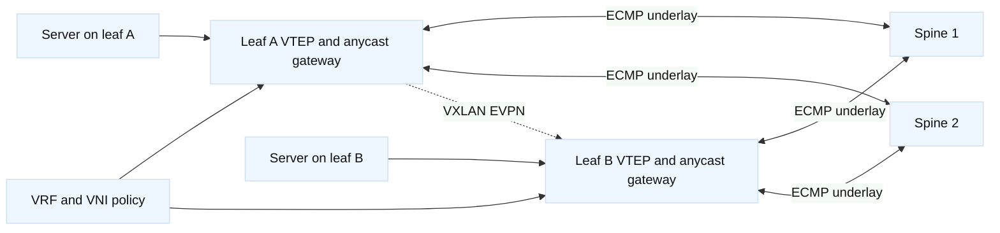
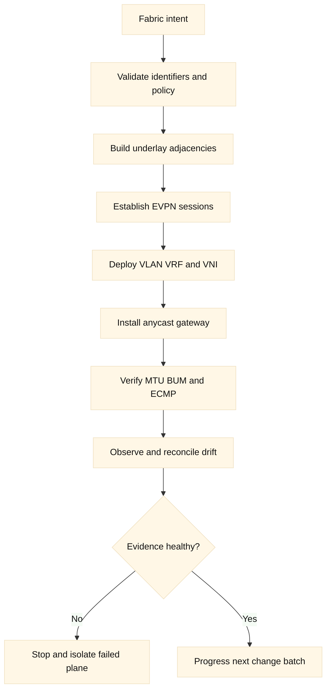
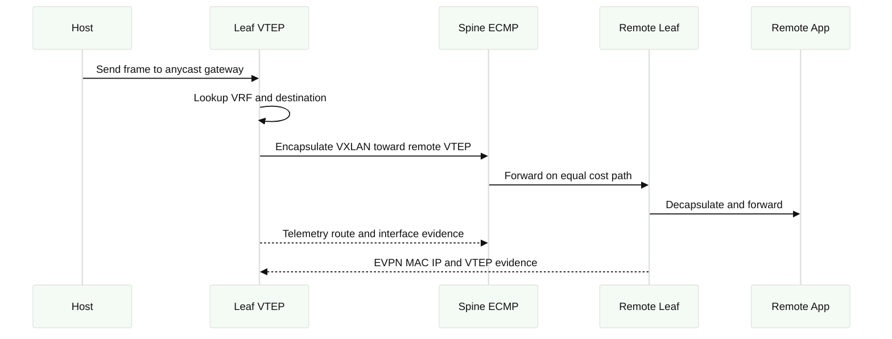
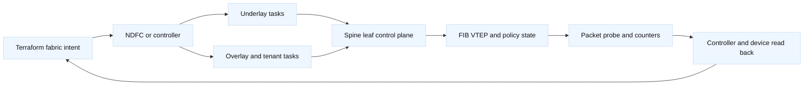
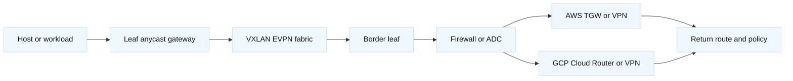

# 18. Spine-Leaf Switching and Fabric as Code

## A. Learning objectives

By the end of this module, you should be able to draw a Clos fabric, explain
why leaf switches terminate host-facing policy while spine switches provide
transit, and choose a control-plane design for a small or large data center.
You should be able to distinguish an underlay from a VXLAN EVPN overlay, map
VLANs to VNIs and VRFs without confusing local identifiers with end-to-end
contracts, and reason about ECMP, anycast gateways, BUM traffic, MTU, and
failure domains. You should also be able to explain where Terraform belongs in
a fabric workflow, where a controller such as Cisco NDFC belongs, and how
telemetry and read-back establish evidence without proving application health.

The interview outcome is not a memorized configuration stanza. It is a clear
answer that connects requirements to topology, control plane, ownership,
capacity, rollout order, and falsifiable verification. At SDE2 level, you
should trace a packet and identify the first failed dependency. At Staff level,
you should defend the operating model, migration path, blast-radius controls,
and long-term design trade-offs.

## B. Prerequisites

Review Ethernet switching, VLANs, MAC learning, IPv4/IPv6 routing, BGP,
OSPF, IS-IS, ECMP, ACLs, and basic Linux networking. You should understand
Terraform state, provider aliases, modules, plan/apply, drift, and saved-plan
review from [Terraform core and execution model](01-terraform-core-and-execution-model.md).
Review the existing [F5 LTM material](../docs/03-f5-ltm.md) only for the edge
ownership comparison; an ADC is not a replacement for a switching fabric.

Use a simulator, a vendor lab, or redacted fixtures. The examples below use
documentation addresses such as `192.0.2.0/24`, `198.51.100.0/24`, and
`2001:db8::/32`, fictional hostnames, and placeholder credentials. Do not run
configuration commands against a production switch, do not paste secrets into
Terraform plans, and do not treat a sample command as approval to change a
device.

### B.1 Versioned lab contract

**Lab contract v1.0 (illustrative, 2026-08):** record the switch platform and
NOS release, ASIC family, NDFC or other controller release, provider/API
version, Terraform version, underlay protocol, overlay route types, and MTU
assumptions. The disposable topology should contain two spines, two leaves,
one endpoint pair, one border connection, and a cloud test network. A small
emulator demonstrates intent and control-plane reasoning, but cannot validate
ASIC scale, buffering, ECMP distribution, or hardware failover.

| Contract item | Required record | Interview-quality evidence |
| --- | --- | --- |
| Address plan | Loopbacks, point-to-point links, VTEPs, VLAN/VNI/VRF IDs, ASNs | Collision-free generated inventory and reviewable source of truth. |
| Ownership | Direct device, NDFC, NSO, or cloud controller per object | No overlapping owner for rendered interfaces, VLANs, VRFs, or policies. |
| Health | BGP/OSPF, EVPN routes, VTEP state, MTU, BUM, ECMP, probes | Control-plane and data-plane checks are separate. |
| Failure budget | One-spine, leaf, border, peer-link, and cloud-attachment tests | Expected blast radius and stop/rollback decision. |
| Cleanup | Tenant deletion, VNI release, cloud detach, state retention | No abandoned advertisement or unsafe ID reuse. |

**Validated in lab:** the exact hardware/emulator/controller combination.
**Illustrative:** provider schemas and controller resources below.
**Inference:** intent-level controller ownership reduces per-device drift only
when read-back and rollback are trustworthy; abstraction must not hide evidence.

## C. Portable fabric model

A leaf-spine fabric is a Clos network. Every leaf connects to multiple spines,
and every spine connects to every leaf in the normal two-tier design. A host,
server, firewall, load balancer, or external router attaches to a leaf. Spines
usually do not attach endpoints; they provide predictable, equal-cost transit.
This regularity makes path count, failure impact, and capacity easier to reason
about than a deeply hierarchical core-distribution-access design.

The underlay is the routed transport between loopbacks and point-to-point
interfaces. It answers, “How does a VTEP reach another VTEP?” It normally uses
BGP, OSPF, or IS-IS and ECMP. The overlay carries tenant or application
segments across that transport. VXLAN supplies a tunnel encapsulation and EVPN
uses BGP to advertise MAC, IP, Ethernet-segment, and VTEP reachability
information. The underlay does not need to understand each tenant VLAN.

VRF is an isolated routing table. VLAN is a local Layer 2 segmentation
construct. VNI is an overlay identifier, commonly one for a Layer 2 segment and
another for a Layer 3 VRF. These names are related but not interchangeable. A
candidate who says “the VLAN is the VNI” has skipped the boundary between local
switching and overlay identity. **Inference:** keep a system-of-record mapping
for tenant, VRF, VLAN, VNI, gateway address, and ownership so that two teams do
not assign apparently valid but semantically conflicting identifiers.

An anycast gateway gives hosts in the same subnet a consistent default-gateway
address on multiple leaf switches. A host can remain attached to a different
leaf after a maintenance event without changing its gateway IP. The design
still needs consistent ARP/ND behavior, duplicate-address prevention, and a
clear answer for where first-hop policy is enforced.



The two planes must be debugged separately. If a leaf cannot resolve the
remote VTEP loopback, inspect underlay interfaces, routing adjacencies, route
selection, and MTU. If the VTEP is reachable but a remote host is unknown,
inspect EVPN sessions, route types, VLAN-to-VNI mapping, MAC mobility, and BUM
replication. If the host is reachable but an application fails, inspect policy,
DNS, load-balancer behavior, and the application itself.

## D. Architecture and design choices

### D.1 Clos roles and scale

Leaf count determines attachment capacity and the number of east-west paths.
Spine count determines path diversity and aggregate transit capacity. A simple
capacity model is `usable_fabric_capacity = spine_count * link_capacity *
oversubscription_factor`, with the factor defined by the design rather than
assumed to be one. If eight leaves each offer four 100-Gbps uplinks to four
spines, the physical uplink capacity is 1.6 Tbps, but a 3:1 oversubscription
policy means the host-facing design cannot promise 1.6 Tbps of simultaneous
application traffic. Staff candidates state whether the number is raw,
available, or committed capacity.

The fabric should define failure domains explicitly. Losing one spine should
remove one ECMP next hop, not isolate a leaf. Losing one leaf should affect
its attached endpoints, not every tenant. Losing a pair of MLAG or vPC peers
may have a larger impact than losing a single spine because the pair can share
state and a control relationship. A topology diagram that shows links but not
failure domains is incomplete.

### D.2 Underlay protocol selection

eBGP is common because each link can be a separate autonomous-system
relationship, policy is explicit, and route exchange is easy to constrain.
OSPF offers familiar link-state operations and fast internal convergence. IS-IS
is also a link-state protocol and can scale well in large networks. The right
interview answer compares operational skill, tooling, route-policy needs,
failure detection, convergence objectives, and vendor support. It does not
claim that one protocol is universally superior.

The underlay normally advertises loopbacks and point-to-point prefixes, not
every tenant route. BGP unnumbered, BFD, maximum-prefix limits, passive
interface controls, and explicit import/export policy may reduce risk, but
their syntax and support vary by platform and release. **Vendor terminology:**
NX-OS, EOS, Junos, NDFC, vPC, MLAG, EVPN, and VXLAN describe ecosystem
features; exact defaults must be verified against the selected switch release.

### D.3 Overlay, BUM, and MTU

VXLAN adds overhead to an original Ethernet frame. The underlay MTU therefore
needs enough headroom for the selected encapsulation, headers, and any tunnel
or security layers. A path that works for small pings can still fail for large
frames or TCP segments that trigger fragmentation or black-hole behavior. A
proper test varies packet size and the DF/PMTUD behavior relevant to the
platform. **Fact:** the exact overhead, supported MTU, and fragmentation
behavior are release and platform dependent; verify them rather than relying
on a remembered number.

BUM means broadcast, unknown unicast, and multicast. A fabric can use ingress
replication or multicast-assisted replication. The choice affects state,
bandwidth, underlay requirements, and failure behavior. ARP and ND suppression
can reduce flooding, but stale control-plane information can create a different
failure mode. A candidate should explain how an unknown destination is learned,
flooded, or rejected and which telemetry proves the answer.

### D.4 vPC, MLAG, and endpoint attachment

vPC and MLAG are multichassis link-aggregation mechanisms. They can provide
redundant attachment for a server or appliance, but they create a peer-control
relationship, consistency checks, and split-brain risks. EVPN multihoming is a
different design family and should not be casually equated with vPC. Ask which
device owns the gateway, how peer failure is detected, and whether a dual-home
endpoint can safely forward during an isolated peer event.



## E. Terraform, provider, controller, and API boundaries

Terraform is useful for declaring inventory, device variables, provider
configuration, and the intended ownership boundary. A network-device provider
may call NX-API, REST, NETCONF, or a vendor-specific API. A controller such as
Cisco NDFC may own the fabric intent and render switch configuration. The
critical question is not “Can Terraform send this command?” but “Who is the
authoritative owner of this object, and what happens when another system
reconciles it?”

Do not let Terraform manage a switch interface with a device controller while
the controller also owns that interface. If Terraform owns NDFC fabric intent,
the state should represent the controller resource and its durable identifiers;
NDFC should render the switch configuration. If a team instead uses Terraform
against devices directly, it needs a precise device-resource ownership model,
read-back behavior, schema compatibility, and a plan that can detect out-of-
band changes. A raw CLI provisioner is generally a weak ownership boundary:
its command output, idempotency, error semantics, and drift model are often
insufficient. **Inference:** use it only as a narrowly documented bridge with
post-change read-back and a migration plan.

The following is illustrative HCL. Provider names, resource names, and fields
vary by vendor and release; treat them as a design-shaped example, not a claim
that every provider exposes these exact resources.

```hcl
terraform {
  required_version = ">= 1.6, < 2.0"
  required_providers {
    nxos = {
      source  = "example.invalid/vendor/nxos"
      version = "~> 1.0" # Placeholder; verify the selected provider.
    }
  }
}

provider "nxos" {
  address  = var.switch_api_endpoint
  username = var.switch_username
  password = var.switch_password # Inject at runtime; never commit.
  # Configure a trusted CA; do not disable TLS verification.
}

resource "nxos_vrf" "training" {
  name        = "VRF_TRAINING"
  description = "Disposable interview lab"
}

resource "nxos_vlan" "application" {
  id          = 210
  name        = "VLAN_TRAINING_APP"
  vni         = 10210
  vrf_name    = nxos_vrf.training.name
  owner       = "training-platform"
}
```

For an NDFC-oriented design, a module might declare a fabric and a network
intent rather than each rendered interface:

```hcl
variable "fabric_id" { type = string }

resource "example_ndfc_network" "training_app" {
  fabric_id       = var.fabric_id
  name            = "training-app"
  vrf             = "VRF_TRAINING"
  vlan_id         = 210
  vni             = 10210
  gateway         = "192.0.2.1/24"
  attach_leaf_ids = ["leaf-a-lab", "leaf-b-lab"]
  # Controller validates and renders device-specific details.
}
```

The first example has device-level ownership; the second has controller-level
ownership. They should not both manage the same VLAN, VRF, or gateway. State
must record which boundary is selected. A module output such as
`network_intent_id` is safer than exposing an assumption that every switch has
the same generated interface syntax.

## F. Concrete setup, use, and verification

### F.1 Switch and fabric lab setup

Before a lab change, record the switch platform, software release, API or
NETCONF capability, management address, lab partition, and rollback mechanism.
Use environment-injected credentials and a read-only account for discovery.
Run `terraform fmt`, `terraform init`, `terraform validate`, and a plan against
the disposable target. If a provider cannot produce a useful plan, call that
out as an operational limitation rather than hiding it behind `apply`.

Illustrative commands are intentionally non-production and use placeholders:

```bash
export TF_VAR_switch_api_endpoint="https://switch-a.lab.example.invalid"
export TF_VAR_switch_username="terraform-lab"
export TF_VAR_switch_password="INJECT_AT_RUNTIME"
terraform fmt -check
terraform init
terraform validate
terraform plan -out=tfplan.lab

# Read-only shaped verification; exact commands vary by NX-OS release.
show version
show interface status
show bgp l2vpn evpn summary
show nve peers
show nve vni
show mac address-table dynamic
show ip route vrf VRF_TRAINING
```

Do not place a password in shell history or paste command output containing
serial numbers, management addresses, or customer topology. A successful plan
means Terraform found a proposed change; a successful API call means a device
or controller accepted a request. Verification needs control-plane read-back,
interface counters, route and EVPN state, and a bounded test flow.

### F.2 AWS and GCP comparison

AWS and GCP do not expose a customer-managed spine-leaf fabric in the same way
as a data-center switch lab. Their managed networks still provide useful
comparison points: a cloud customer consumes a provider-operated Clos-like
backbone, while Terraform controls virtual network intent, routes, firewall
policy, and service endpoints. The customer normally cannot inspect the
provider’s spine BGP sessions or configure its VXLAN EVPN fabric.

| Design concern | Physical or virtual fabric lab | AWS | GCP |
| --- | --- | --- | --- |
| Underlay owner | Network team and switch OS | Cloud provider | Cloud provider |
| Customer control | Interfaces, routing, EVPN, VLAN/VNI | VPC, subnets, routes, SG/NACL, TGW or similar service | VPC, regional subnets, routes, firewall, Cloud Router |
| ECMP visibility | Device route and forwarding tables | Service-specific telemetry and route analysis | Route and flow telemetry, service-specific views |
| Overlay vocabulary | VXLAN VNI and EVPN | Provider-managed implementation; do not infer customer VXLAN control | Provider-managed implementation; do not infer customer VXLAN control |
| Verification | CLI/API plus test traffic | Cloud API, flow logs, health, bounded probe | Cloud API, flow logs, health, bounded probe |

**Inference:** the interview comparison should ask where the abstraction stops.
On switches, you may own physical links, protocol timers, MTU, and VTEP
behavior. In AWS or GCP, you own the customer-visible contract and must use
provider documentation and telemetry for the managed portion. A cloud route
that exists is not proof that a security policy, service endpoint, or workload
is healthy.

### F.3 Telemetry and falsifiable diagnosis

Useful signals include interface errors and discards, optics or transceiver
alarms, BGP/OSPF/IS-IS adjacency state, route counts, EVPN session state,
VTEP peer state, MAC moves, ARP/ND suppression counters, VXLAN drop reasons,
MTU probes, BUM rates, queue drops, and application traces. Correlate them by
time and path. “The dashboard is green” is not an evidence chain.



A good diagnosis states a hypothesis and a falsifier. For “MTU causes the
failure,” the falsifier is a successful DF-set payload above the expected
encapsulation threshold across the same path. For “EVPN is broken,” the
falsifier is a current EVPN route for the destination MAC/IP plus successful
decapsulation counters. For “the application is down,” a direct backend probe
from an authorized test point can distinguish network loss from application
failure.

## G. State and ownership analysis

Terraform state is a record of resource identity and provider-observed
attributes, not a complete source of truth for every switch behavior. Some
platform-generated defaults, operational counters, learned MACs, and controller
rendered fields may not belong in desired configuration. Sensitive state can
also reveal topology and tenant names even when it does not contain passwords.

Separate state by fabric, environment, and ownership boundary when that reduces
blast radius and access. A single state containing all switches, NDFC intent,
AWS networks, GCP networks, and F5 objects creates a large approval and outage
domain. Multiple states create dependency and sequencing work, so publish
small, stable outputs and define who can change each state. **Staff focus:**
explain why the split is worth the coordination cost and how a partial apply is
recovered.

| Object | Candidate owner | Evidence of ownership | Drift response |
| --- | --- | --- | --- |
| Physical port baseline | Fabric controller or switch team | Inventory and controller assignment | Reconcile or open change; do not overwrite blindly |
| Tenant VRF/VNI intent | One Terraform module or NDFC | State address and intent ID | Review diff and dependency impact |
| Learned MAC/ARP entries | Device control/data plane | Read-only operational state | Never import as desired configuration |
| Cloud VPC attachment | AWS/GCP Terraform state | Account/project and resource ID | Refresh, classify, and coordinate |
| F5 virtual server | F5 owner or AS3 tenant | Partition and declaration contract | Stop co-ownership and reconcile |

## H. Safe rollout, rollback, and cleanup

Roll out from low-risk dependencies to higher-level behavior: inventory and
capability checks, underlay links and loopbacks, routing adjacencies, EVPN
control plane, VRF/VLAN/VNI objects, gateway and endpoint attachment, then
bounded traffic validation. Batch by failure domain. A canary leaf or tenant is
more informative than changing every leaf at once, but the canary must exercise
the same platform, release, and policy shape as the intended population.

Rollback is not always “reverse the last plan.” If an underlay protocol change
removes reachability, restore the last known-good adjacency policy and verify
out-of-band access. If a VNI or gateway was already consumed, changing the
identifier can create a new outage; preserve state and use a forward repair or
maintenance migration. If a controller task partially rendered, inspect task
status and device read-back before retrying. Never repeatedly apply an unknown
operation without determining whether the first operation succeeded.

Cleanup in a lab means remove only the resources created by the exercise, in
reverse dependency order, after capturing the plan and read-back needed for
learning. It does not mean deleting an entire shared fabric. `terraform
destroy` is intentionally not shown as an unconditional command because a
module may contain shared networks or controller-managed objects.

## I. Exercises

### I.1 Design a two-spine, four-leaf fabric

**Timebox:** 25 minutes. **Assumptions:** four leaves, two spines, two tenant
VRFs, 100-Gbps leaf-spine links, one dual-homed appliance pair, and a 3:1
oversubscription target. **Deliverables:** a topology diagram, loopback and
point-to-point addressing plan, underlay protocol choice, VLAN/VNI/VRF table,
failure-domain table, and five verification commands. **Answer guidance:**
state whether two spines provide enough maintenance capacity, show all leaf to
spine paths, reserve identifiers, and explain how an appliance peer failure
differs from a spine failure. Include MTU and BUM decisions.

### I.2 Review a Terraform plan for a fabric change

**Timebox:** 20 minutes. A plan replaces a VRF, changes `vni = 10210` to
`vni = 10201`, updates all four leaves, and includes a controller task with no
read-back. **Deliverables:** risk ranking, stop/go decision, questions for the
provider owner, and a safer staged plan. **Answer guidance:** stop the plan;
an identifier replacement can affect every tenant attachment, and absence of
read-back prevents confirmation. Check ownership, references, VNI uniqueness,
state freshness, controller compatibility, and a canary path before approval.

### I.3 Debug an intermittent large-packet failure

**Timebox:** 15 minutes. Small HTTPS requests work, but a 2,000-byte payload
fails between hosts in different leaves. **Deliverables:** ordered hypotheses,
tests, expected evidence, and falsifiers. **Answer guidance:** inspect host
MTU, leaf-to-spine MTU, VXLAN overhead, DF/PMTUD behavior, ACL counters, and
fragmentation. A successful small ping does not falsify the MTU hypothesis.

## J. Interview questions and direct answers

### J.1 Why separate the underlay from the overlay?

**Answer:** The underlay provides stable IP reachability between VTEPs and
usually carries loopback and point-to-point routes. The overlay maps tenant
segments and VRFs onto that transport, so tenant changes do not require the
underlay to learn every endpoint route. The separation also narrows diagnosis:
first prove VTEP reachability, then prove EVPN learning, then prove policy and
application behavior.

**SDE2 focus:** Trace one packet through each plane and name the evidence.

**Staff extension:** Explain ownership, convergence objectives, route-scale
limits, change sequencing, and what happens when the overlay is healthy but the
underlay has reduced capacity.

### J.2 When is eBGP preferable to OSPF or IS-IS in a fabric?

**Answer:** eBGP can make each leaf-spine relationship explicit, provide clear
import/export policy, and fit a design where each link is treated as a small
administrative relationship. OSPF or IS-IS may be preferable where link-state
operations, existing expertise, and fast internal topology propagation are
stronger. The answer depends on scale, support, policy, automation, and
failure-detection requirements, not a universal protocol ranking.

**SDE2 focus:** Compare adjacency formation, route advertisement, and one
failure test.

**Staff extension:** Discuss operational maturity, policy guardrails,
multi-vendor behavior, convergence measurement, and how the organization will
debug the chosen protocol at 3 a.m.

### J.3 What does an anycast gateway solve, and what does it not solve?

**Answer:** It gives hosts a consistent first-hop address on multiple leaves,
which supports local routing and endpoint mobility during a leaf change. It
does not solve duplicate IP ownership, policy placement, host ARP/ND bugs,
inter-VRF authorization, MTU, or application health. The gateway must still be
advertised and programmed consistently, and its failure behavior must be tested.

**SDE2 focus:** Explain a host’s ARP/ND exchange and the leaf’s VRF lookup.

**Staff extension:** Define consistency enforcement, tenant isolation, gateway
scale, and the blast radius of a bad anycast configuration.

### J.4 How do you distinguish a VXLAN problem from an application problem?

**Answer:** Use a layered evidence chain: underlay route to the remote VTEP,
EVPN session and route presence, VTEP peer state, decapsulation and drop
counters, VRF route lookup, policy counters, and a bounded probe from a known
source. If all network evidence is current and the backend accepts a direct
authorized probe, the application or service contract becomes more likely.
Each hypothesis needs a test that could disprove it.

**SDE2 focus:** Name the first three read-only checks and the expected result.

**Staff extension:** Explain telemetry retention, ownership handoff, SLO impact,
and how to avoid granting broad emergency access while diagnosing.

### J.5 Why is Terraform not automatically the right tool for every switch CLI?

**Answer:** Terraform expects a resource lifecycle, stable identity, a state
model, and a meaningful diff. A CLI command may be imperative, non-idempotent,
weakly reported, or unable to read back all device defaults. Sending it from a
provisioner can create a false sense of declarative safety. A provider or
controller with a defined ownership boundary is usually stronger; a bridge must
include bounded scope, read-back, failure handling, and a retirement plan.

**SDE2 focus:** Explain the difference between API acceptance and convergence.

**Staff extension:** Choose direct device management versus NDFC and defend
state partitioning, approvals, recovery, and organizational ownership.

### J.6 What makes a fabric rollout safe?

**Answer:** A safe rollout has a fresh plan, capability and version checks,
stable identifiers, a canary, failure-domain batches, explicit preconditions,
read-only verification, traffic probes, a stop condition, and a tested recovery
path. It also records whether rollback is possible or whether a forward repair
is required. A successful configuration task is one signal, not the completion
criterion.

**SDE2 focus:** Provide an ordered rollout and three go/no-go checks.

**Staff extension:** Define change authority, concurrency control, SLO/error
budget gates, communications, and how the platform prevents co-ownership.

## L. Fabric implementation lanes and design depth

### L.1 Addressing, ASN, and identifier plan

Start a fabric design with an allocation contract rather than scattered
interface values. Reserve independent pools for loopbacks, point-to-point
underlay links, VTEP addresses, tenant prefixes, VLAN IDs, VNIs, and BGP ASNs.
Define whether identifiers are globally unique, unique per fabric, or unique
only inside a VRF. A generated value is not automatically safe: the allocator
must detect collisions, retained state, and an old tenant that has not fully
drained.

**Fact:** loopbacks commonly provide stable router IDs and VTEP identities,
while point-to-point addresses identify underlay links. **Vendor terminology:**
VTEP, VLAN, VNI, VRF, route distinguisher, route target, and anycast gateway
are common VXLAN EVPN terms; implementation and defaults vary. **Inference:**
put allocation and reservation in a reviewable data source or platform
service, and make Terraform fail before a collision reaches a switch.

For a sample lab, reserve `198.51.100.0/24` for loopbacks, `192.0.2.0/24`
for point-to-point links, VNI `10210` for tenant application VLAN `210`, and a
dedicated ASN range. The numbers are documentation-only. The plan review
should show the generated mapping, the previous allocation, and the release
policy. Reusing a VNI immediately after deletion can be unsafe if stale MAC,
ARP, EVPN, or endpoint state remains in the fabric.

### L.2 EVPN route types and endpoint learning

An SDE2 answer should explain what is being advertised, not just say “EVPN
handles it.” **Vendor terminology:** EVPN route types commonly include MAC/IP
advertisements, inclusive multicast membership, Ethernet segment routes, and
IP prefix routes. The exact supported subset and display syntax are platform
dependent. MAC/IP advertisements can distribute endpoint reachability and
ARP/ND information; inclusive multicast routes help build BUM replication
state; Ethernet segment routes support multihoming behavior; IP prefix routes
can advertise routed tenant prefixes.

Ask four questions: which VTEP owns the endpoint, how is the endpoint moved,
how is ARP/ND suppression populated, and what happens when two devices claim
the same address? A MAC move or duplicate-address event can be caused by a
legitimate migration, a loop, stale state, or an attack. Evidence should
include route age or sequence behavior where available, MAC move counters,
endpoint attachment, ARP/ND state, and the underlay path to the remote VTEP.

### L.3 Border leaves and external service insertion

Border leaves connect the fabric to firewalls, ADCs, WAN routers, AWS, GCP, or
other fabrics. Decide whether the border advertises a default route, specific
tenant prefixes, or both; which device owns route leaking; and where policy is
enforced. An anycast gateway can make east-west traffic local, but north-south
traffic still needs a symmetric and observable service path. An ADC or firewall
that receives traffic on one leaf and returns it through another can expose
asymmetry, state mismatch, or unexpected SNAT behavior.

**Staff design questions:** is the border pair an independent failure domain?
Does a single border outage remove one ECMP path or an entire tenant? Are
external BGP communities, local preference, MED, and maximum-prefix limits
part of the contract? Can a cloud route advertisement leak into another VRF?
The answer should connect policy to blast radius and a traffic-shift plan.

### L.4 BUM, MTU, and capacity calculations

Ingress replication avoids a multicast dependency but can multiply traffic and
state across VTEPs. Underlay multicast can reduce replication work in some
designs but adds rendezvous, group, and failure evidence. Neither is free.
Measure BUM rate, VTEP count, tenant scale, and convergence behavior for the
chosen design. **Fact:** VXLAN adds encapsulation overhead; the exact supported
MTU and fragmentation behavior depend on headers, tunnels, ASIC, and NOS.

For capacity, record host-facing demand, uplink bandwidth, expected ECMP
distribution, oversubscription, and N+1 capacity. If four spines each provide
100 Gbps uplinks to a leaf, losing one spine leaves three physical paths, but
usable application capacity depends on hashing, queueing, link failures, and
traffic shape. **Inference:** a Staff answer should state the degraded-mode
capacity commitment rather than cite raw port speed as guaranteed throughput.

### L.5 NDFC or controller implementation lane

For a Cisco NDFC-style lab, the sequence is discovery and onboarding, fabric
definition, underlay parameters, overlay or network intent, leaf attachment,
task execution, device read-back, and drift/reconciliation review. **Vendor
terminology:** NDFC fabric and network objects are controller concepts; exact
API resources and task behavior vary by release. Terraform should store the
durable controller identity and desired inputs, while the controller renders
device-specific configuration.



If the controller reports success but an endpoint cannot communicate, inspect
the task result and rendered configuration, then underlay and EVPN state, then
VLAN/VNI/VRF, gateway, ACL, MTU, and return path. A controller task is not a
substitute for a packet probe.

## M. Concrete AWS and GCP fabric-attachment patterns

### M.1 AWS attachment at a border leaf

**Prerequisites:** an isolated AWS account and region, VPC CIDRs that do not
overlap the fabric, a Transit Gateway or Site-to-Site VPN design, border-leaf
interfaces and BGP ASNs, a prefix allow-list, cloud route tables, security
groups, VPC Flow Logs, and a disposable workload. Decide whether Terraform
owns the AWS attachment or only the cloud side while NDFC/NSO owns the Cisco
border. A route table and a fabric policy must not be co-owned accidentally.

```hcl
provider "aws" {
  region = var.aws_region
  # Use an injected role and a separate state boundary for cloud resources.
}

resource "aws_vpc" "fabric_attachment" {
  cidr_block           = "10.81.0.0/16"
  enable_dns_hostnames = true
  tags = { Name = "fabric-cloud-lab" }
}

resource "aws_subnet" "workload" {
  vpc_id            = aws_vpc.fabric_attachment.id
  cidr_block        = "10.81.20.0/24"
  availability_zone = var.aws_zone
}

resource "aws_route_table" "workload" {
  vpc_id = aws_vpc.fabric_attachment.id
  route { cidr_block = "192.0.2.0/24", transit_gateway_id = var.tgw_id }
}

output "fabric_to_aws_prefix" { value = aws_vpc.fabric_attachment.cidr_block }
```

The snippet is **illustrative** and omits attachment-specific resources whose
arguments differ between TGW, VPN, and Direct Connect. Verify AWS route-table
association and propagation, BGP advertisements at the border, Cisco RIB/FIB
in the correct tenant VRF, security-group behavior, VPC Flow Logs, and a
bidirectional probe. Failure cases include an AWS route pointing at an
attachment that does not propagate the prefix, an accepted BGP session with
the tenant route denied, overlapping CIDRs, asymmetric traffic through two
borders, and a fabric ACL that permits the route but drops the application.

### M.2 GCP attachment at a border leaf

**Prerequisites:** a GCP project, custom-mode VPC, regional subnet, HA VPN or
Interconnect, Cloud Router ASN, Cisco peer ASN, explicit custom route
advertisement, firewall priorities, VPC Flow Logs, and a test VM or managed
service. Choose the region and failure domain deliberately; a single regional
attachment does not provide global resilience by itself.

```hcl
provider "google" {
  project = var.gcp_project
  region  = var.gcp_region
  # Credentials are injected through the execution environment.
}

resource "google_compute_network" "fabric_attachment" {
  name                    = "fabric-cloud-lab"
  auto_create_subnetworks = false
}

resource "google_compute_subnetwork" "workload" {
  name          = "fabric-workload"
  region        = var.gcp_region
  ip_cidr_range = "10.91.20.0/24"
  network       = google_compute_network.fabric_attachment.id
  log_config { aggregation_interval = "INTERVAL_5_SEC", flow_sampling = 0.5, metadata = "INCLUDE_ALL_METADATA" }
}

resource "google_compute_router" "cloud_router" {
  name    = "fabric-cloud-router"
  region  = var.gcp_region
  network = google_compute_network.fabric_attachment.id
  bgp { asn = 64530 }
}

output "fabric_to_gcp_prefix" { value = google_compute_subnetwork.workload.ip_cidr_range }
```

Add the selected HA VPN, tunnel, BGP peer, and route resources only after
checking the provider schema. Verify Cloud Router state and advertisements,
effective VPC routes, firewall priority, border-leaf policy, EVPN reachability
to the border VTEP, and a return-path probe. Failure cases include an omitted
custom advertisement, a higher-priority firewall deny, a route learned into
the wrong VRF, an MTU mismatch across the tunnel, and a border failure that
does not converge to the second attachment.

### M.3 Cloud failure and rollback contract

Capture cloud and fabric route snapshots before changing advertisements. Roll
out one cloud attachment or one border policy at a time; require expected
prefix counts, stable BGP/EVPN sessions, no FIB loss, and successful probes
before expanding. If the new policy withdraws a known-good path, restore the
prior policy or shift to the prior attachment. If the route is correct but an
ACL, MTU, or application dependency fails, use a forward fix with the owning
team rather than deleting healthy intent. **Inference:** rollback authority
must be assigned to the team that can restore the traffic path, not merely the
team that authored the Terraform plan.

## N. Additional exercises and detailed answer keys

### N.1 Exercise: duplicate MAC and suspected endpoint move

**Starting state:** a tenant endpoint moves from leaf A to leaf B. Some flows
continue, others reset. EVPN session state is established, but logs show MAC
move or duplicate-address events. Terraform shows no pending change.

**Deliverables:** identify three possible causes, list evidence in control/data
plane order, propose containment, and state when to roll back. **Rubric:** 2
points for EVPN/MAC evidence, 2 for endpoint and attachment verification, 2
for loop or duplicate detection, 2 for safe containment, and 2 for a clear
rollback/forward-fix choice.

**Answer reasoning:** confirm whether the endpoint really moved, whether both
leaves learn it simultaneously, and whether the MAC/IP binding is stable. Read
EVPN MAC/IP advertisements, sequence or age information where available,
Ethernet-segment or multihoming state, local MAC tables, ARP/ND, port-channel
and endpoint logs. A genuine move can be normal; simultaneous learning may
indicate a loop, dual attachment error, stale state, or spoofing. Contain the
smallest attachment or disable the suspect test endpoint in the lab, preserving
evidence. Do not flush every tenant’s MAC table or alter route policy without
scope. Roll back a recent attachment/VLAN change only if it correlates with the
event and restoring it will not strand the endpoint; otherwise repair the
attachment or endpoint as a forward fix.

**SDE2 follow-up:** what evidence separates a move from a loop? **Staff
follow-up:** how would your platform prevent VNI reuse or duplicate ownership
from becoming a fabric-wide incident?

### N.2 Exercise: border-leaf outage during cloud traffic

**Starting state:** two border leaves advertise a tenant prefix to AWS or GCP.
One border loses its uplinks. BGP remains established on the other border, but
some clients have black holes and large responses fail.

**Deliverables:** draw the path before and after failure, define checks for
underlay, EVPN, external BGP, FIB, MTU, and cloud return routing, and propose a
bounded recovery. **Rubric:** 2 points for path/failure-domain reasoning, 2
for convergence evidence, 2 for MTU and asymmetric return analysis, 2 for
cloud verification, and 2 for stop/rollback criteria.

**Answer reasoning:** establish whether the failed border was withdrawn from
ECMP and external advertisements, whether the surviving border has the route
and correct next hop, and whether cloud route propagation still targets the
failed attachment. Compare small and large probes to expose MTU/PMTUD issues;
large-response failure is not proof of BGP failure. Inspect anycast gateway,
EVPN type-5 or equivalent prefix state, external BGP policy, cloud route table,
firewall/log evidence, and both directions. If the new border policy caused
the issue, restore the known-good policy or keep traffic on the surviving
border. If the outage is physical and convergence is correct, do not roll back
healthy intent; repair the failed domain and communicate reduced capacity.

**SDE2 follow-up:** why can small pings pass while application responses fail?
**Staff follow-up:** what degraded-capacity SLO and maintenance policy would
you publish for a border pair?

## O. Additional interview dialogue and follow-ups

### O.1 Dialogue: “Why not put every fabric command in Terraform?”

**Candidate:** “Terraform is strongest where there is a stable resource
identity, meaningful diff, idempotent lifecycle, and read-back. A fabric spans
many devices and has controller transactions, protocol convergence, and ASIC
state. I would have Terraform own NDFC intent or a narrowly defined device
object, not issue opaque commands that cannot be reconciled. The owner and
failure evidence determine the boundary.”

**Interviewer follow-up:** “What would you do when the provider lacks a
feature?”

**Candidate:** “I would verify whether the controller or supported API models
it, use a reviewed integration boundary with explicit task polling and
read-back, or leave the feature manual temporarily with an audited exception.
The bridge needs a bounded scope, rollback plan, and retirement target. Staff
design also prevents a second system from co-owning the rendered object.”

### O.2 Dialogue: “How do you prove a VXLAN issue is not an application issue?”

**Candidate:** “I would walk from the source leaf to the remote VTEP: underlay
reachability, BGP/EVPN session, endpoint or prefix route, VTEP peer state, VLAN
to VNI and VRF mapping, anycast gateway, ACL counters, MTU, and decapsulation
or drop counters. Then I would run a bounded probe and correlate it with the
backend or cloud flow log. A green EVPN session is necessary but not sufficient;
it does not prove FIB installation or application acceptance.”

**Interviewer follow-up:** “When is rollback justified?”

**Candidate:** “If a recent tenant or border change caused a broad SLO impact
and the previous path is known good, restore the prior intent in the smallest
failure domain and verify. If the control plane is correct and the issue is a
bad endpoint, firewall, or MTU contract, rollback could hide the cause; use a
forward fix. At Staff level I would add canaries, prefix and capacity gates,
evidence retention, and a clear owner for the traffic shift.”

## K. Implementation lab extensions

### K.1 Addressing, identifiers, and allocation policy

Use deterministic pools so that a reviewer can infer intent from a plan. For a
small lab, allocate a /32 loopback per switch from `192.0.2.0/24`, point-to-point
underlay links from `198.18.0.0/15`, VTEP addresses from a separate loopback
range, and tenant prefixes from a documented private range. Keep the pools
separate: reusing a host or VTEP address as a transit address makes failures
harder to isolate. Allocate VLANs, VNIs, VRFs, and BGP ASNs from a registry or
module input rather than from operator memory.

**Staff reasoning:** the important property is collision prevention and safe
allocation under parallel work. A registry can be a reviewed data file, an
IPAM system, or a controller API. Terraform should fail during planning when a
requested VNI or ASN is already allocated. It should not discover a collision
after a partial fabric change.

### K.2 EVPN route types and endpoint learning

EVPN is a control-plane family carried by BGP. Route type 2 advertises MAC/IP
bindings, route type 3 supports inclusive multicast distribution, and route
type 5 carries IP prefixes in designs that use IP prefix advertisement. The
exact supported route types and output vary by platform and release. In an
interview, connect each route to an observable symptom: a missing type 2 can
look like unknown-unicast flooding, a missing type 3 can break BUM delivery,
and a missing type 5 can break routed reachability across a border or VRF.

Host mobility and duplicate-MAC events need special care. A moving endpoint
may cause sequence-number changes; repeated moves may indicate a loop, vPC
miswiring, virtualization behavior, or an address collision. Do not suppress
the symptom by clearing tables first. Capture the endpoint, VTEP, timestamp,
route type, sequence information, and interface counters, then test one
hypothesis at a time.

### K.3 Border leaves and service insertion

Border leaves connect the fabric to WAN, Internet, AWS, GCP, firewalls, ADCs,
or shared services. Decide where the default route originates, which prefixes
are exported, whether route leaking is allowed between tenant and shared
VRFs, and whether a firewall or A10/F5 service is traversed symmetrically.
An apparently correct EVPN overlay can still fail because the external BGP
policy rejects a prefix or the return path bypasses the service insertion
point.



### K.4 AWS and GCP attachment lab

For AWS, model the cloud side as a VPC with private subnets, route tables,
security groups, and either a Transit Gateway or Site-to-Site VPN. The fabric
side owns the border BGP neighbor and explicit prefix policy; AWS owns the
VPC route propagation and security controls. A useful lab output is the set of
prefixes advertised in each direction and the exact next hop observed on both
ends. VPC Flow Logs provide cloud-side evidence, while border counters and BGP
adjacency state provide on-premises evidence.

For GCP, use a VPC with a regional subnet, firewall rules, and HA VPN with
Cloud Router, or Dedicated/Partner Interconnect when the lab supports it. GCP
dynamic routes are learned through Cloud Router and are subject to custom
advertisement and import/export choices. Cloud Logging and VPC Flow Logs
should be correlated with the Cisco VRF route and interface evidence. Do not
assume AWS route-table terminology maps one-to-one to GCP dynamic routing.

Illustrative cloud-side Terraform shape:

```hcl
variable "cloud_prefix" { type = string }

# AWS and GCP providers are intentionally omitted here: authenticate through
# the normal CI identity and pin versions in the root module's lock file.
# The fabric controller or device provider receives the resulting prefix and
# attachment identifiers through a reviewed module interface.

output "handoff_contract" {
  value = {
    advertised_prefix = var.cloud_prefix
    aws_next_hop       = "tgw-or-vpn-attachment-id"
    gcp_next_hop       = "cloud-router-peer-id"
  }
}
```

Verify the contract with a cloud route-table read, a device VRF/RIB/FIB read,
and a bounded probe in both directions. A route present in a control-plane
table is not proof that a security policy, return path, or workload listener
permits traffic.

### K.5 Capacity and resilience arithmetic

Calculate oversubscription from downlink capacity divided by usable uplink
capacity, then test the result against the workload's burst profile rather
than quoting a universal “good” ratio. For N+1 maintenance, remove one spine
from the ECMP set and check whether the remaining links carry the peak offered
load with the agreed headroom. Include tunnel overhead in MTU: a payload that
fits a host interface may exceed the underlay after VXLAN, UDP, and outer-IP
headers are added. Document the assumed header sizes and whether the platform
supports jumbo frames end to end.

## L. Advanced exercises and answer keys

### L.1 Duplicate MAC and endpoint mobility

**Starting state:** a tenant endpoint alternates between two leaves and users
report short outages. **Deliverables:** a hypothesis tree, five read-only
checks, the likely control-plane evidence, and a containment/rollback choice.

**Answer:** correlate MAC moves by timestamp and VTEP, inspect vPC/MLAG peer
consistency, verify whether the endpoint is actually dual-attached, and check
for a loop or virtualization migration. Compare EVPN route sequence data with
local MAC tables and interface flaps. If one access port is clearly looping,
contain that port under the approved change authority; do not globally clear
EVPN state. Restore the last known-good attachment only when it is known to be
safe, then verify host ARP/ND and application probes. **Staff follow-up:** add
duplicate-address alerts, owner metadata, and a change gate for port-channel
membership.

### L.2 Border-leaf outage during cloud traffic

**Starting state:** one border leaf fails while AWS and GCP workloads remain
partially reachable. **Deliverables:** explain expected convergence, list cloud
and fabric evidence, and define a rollback threshold.

**Answer:** confirm underlay reachability and EVPN peer status, then check the
surviving border's BGP sessions, accepted prefixes, route preference, ECMP,
and return-path advertisements. In AWS inspect TGW/VPN propagation and flow
logs; in GCP inspect Cloud Router learned routes and HA VPN tunnel state. If
the surviving path is healthy, a rollback is usually worse than allowing
convergence; if policy changed during failover and removes the only safe path,
restore the prior policy or withdraw the faulty advertisement. **Staff
follow-up:** define N+1 capacity, failover SLO, route dampening, and an owner
for cross-domain escalation.

## M. Staff interview dialogue

### M.1 “Why choose a controller over direct Terraform-to-switch writes?”

**Candidate:** “I choose based on the ownership unit and read-back quality. A
controller is useful when it owns fabric intent, batches dependent changes,
understands capabilities, and exposes task and drift status. Direct Terraform
can be reasonable for a small, independently managed lab or a stable device
resource. I would not let both systems own VLAN, VNI, gateway, or BGP policy
objects. I would define the boundary, migration path, audit trail, and break-
glass procedure before choosing the tool.”

**Follow-up:** “How do you prove it works?” **Candidate:** “A saved plan is
only configuration evidence. I need controller task success, device read-back,
EVPN/underlay state, route installation, counters, and a bounded data-plane
probe. The acceptance test must exercise the return path and a failure-domain
scenario.”

### M.2 “How do you evolve a fabric without freezing all change?”

**Candidate:** “I separate changes by failure domain, use capability-aware
preconditions, canary one leaf or tenant, and preserve a known-good intent
snapshot. I measure convergence and application impact, not just task duration.
The rollout has explicit stop conditions for BGP churn, MAC moves, packet
loss, and route leaks. Some changes are not safely reversible—for example an
addressing migration—so the plan must describe forward repair as well as
rollback.”

## N. References and evidence labels

**Fact:** VXLAN and EVPN behavior, protocol support, and device defaults are
platform and release dependent. **Vendor terminology:** Cisco NX-OS, NDFC,
vPC, VXLAN EVPN, and their resource/API names belong to Cisco documentation;
other vendors use different models. **Inference:** separate intent ownership
from rendered switch configuration when a controller provides reconciliation.

- [Cisco Nexus 9000 VXLAN EVPN configuration guides](https://www.cisco.com/c/en/us/support/switches/nexus-9000-series-switches/products-installation-and-configuration-guides-list.html)
- [Cisco Nexus Dashboard Fabric Controller documentation](https://www.cisco.com/c/en/us/support/cloud-systems-management/dc-nexus-dashboard-fabric-controller/series.html)
- [RFC 7432: BGP MPLS-based Ethernet VPN](https://www.rfc-editor.org/rfc/rfc7432)
- [RFC 7348: Virtual eXtensible Local Area Network](https://www.rfc-editor.org/rfc/rfc7348)
- [RFC 8365: Network Virtualization Overlay Solution](https://www.rfc-editor.org/rfc/rfc8365)
- [AWS VPC documentation](https://docs.aws.amazon.com/vpc/latest/userguide/what-is-amazon-vpc.html)
- [Google Cloud VPC documentation](https://cloud.google.com/vpc/docs/overview)

Verify switch release, ASIC, license, controller version, provider version,
API/NETCONF capability, MTU behavior, and supported EVPN route types before
using any example. AWS and GCP references describe customer-visible cloud
networking abstractions; they do not document or promise access to the
provider’s internal spine fabric.
