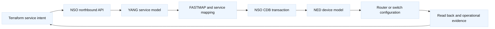
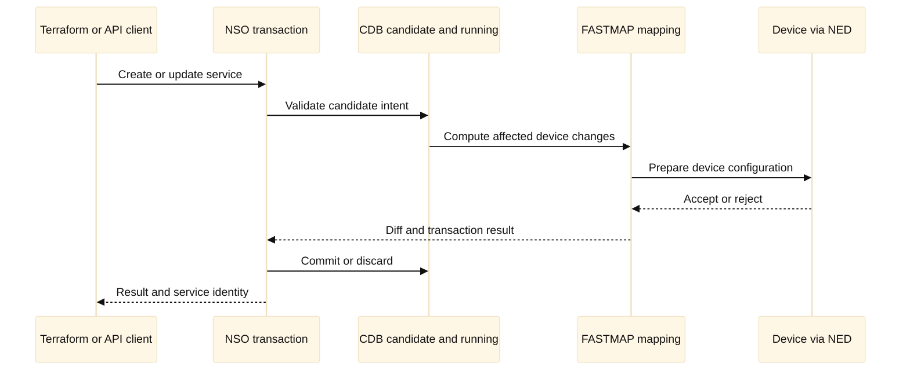
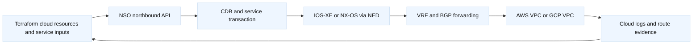

# 19. Cisco NSO Service Models and Terraform

## A. Learning objectives

This module teaches how Cisco NSO turns a service intent into device-specific
configuration and how Terraform can participate without becoming a second,
conflicting network orchestrator. You will explain YANG modules, service
models, templates, service mappings, device models, NEDs, CDB, FASTMAP,
transactions, reconciliation, rollback, and northbound APIs. You will practice
deciding whether Terraform should own an NSO service, a cloud boundary, or
neither, and how to keep Terraform from co-owning the device objects rendered
by NSO.

The interview outcome is an ownership and evidence design. At SDE2 level, you
should trace a service request through Terraform, an NSO API, a service model,
device mapping, transaction, and device read-back. At Staff level, you should
define team boundaries, service evolution, compatibility, multi-device
transactions, auditability, failure recovery, and how the organization avoids
turning two declarative systems into an oscillating control loop.

This is educational interview material, not an operational runbook. Examples
use fictional service names, documentation addresses, placeholder tokens, and
disposable lab devices. Never commit NSO credentials, device passwords, private
keys, rendered secrets, or production topology. Version-specific behavior must
be checked against the selected NSO release, NED release, device software, and
Terraform provider.

## B. Prerequisites

Know basic YANG data trees, XML/JSON, NETCONF, RESTCONF, REST APIs, CLI
configuration modes, transactions, routing and interface concepts, and
Terraform state and modules. Review [Terraform state and backends](03-state-backends-locking-and-workspaces.md),
[multi-provider platform patterns](10-multi-provider-platform-patterns.md), and
[Cisco F5/API automation context](../book/topics/33-f5-api-and-automation-toolchain.md).
You do not need to memorize NSO CLI syntax; you must understand the control
boundaries and evidence.

Use a Cisco NSO evaluation or lab instance with simulator devices where
possible. A simulator still has version and NED limitations. Treat a sample
`curl`, `ncs_cli`, or `netconf-console` command as a shape to adapt after
checking local documentation. A command that commits a configuration is not a
safe default merely because it appears in a tutorial.

### B.1 Versioned lab contract

**Lab contract v1.0 (illustrative, 2026-08):** record NSO release, NED
versions, device software, package revision, Terraform/provider or wrapper
version, API exposure, authentication mode, and HA topology. Use simulator
devices or an isolated lab router. The minimum inventory is one NSO instance,
two simulated device families, one service package, one disposable service
instance, and one cloud-side route domain. A simulator validates model and
transaction reasoning; it does not prove hardware forwarding, license
behavior, or production-scale commit-queue performance.

| Contract item | Required record | Evidence expected |
| --- | --- | --- |
| Model | YANG revision, service keys, constraints, lifecycle rules | Validate, create, update, delete, and compatibility tests. |
| Mapping | Package revision, templates/code, NED capabilities | Dry-run diff and device-specific rendered intent. |
| Transaction | Locks, candidate/running semantics, queue, timeout policy | Correlation ID, commit result, CDB and device read-back. |
| Boundary | Terraform owns service input; NSO owns rendered device objects | Policy or review check preventing co-ownership. |
| Recovery | Prior input, package rollback, reconcile policy, partial-failure owner | Explicit rollback versus forward-fix decision. |

**Validated in lab:** only the selected NSO/NED/device versions and package.
**Illustrative:** provider names, API paths, and YANG snippets in this file.
**Inference:** a stable service contract is safer than exposing vendor CLI
leaves when model evolution and capability differences are tested.

## C. Portable orchestration model

NSO is an orchestration system that can present a service-oriented northbound
model while hiding device-specific configuration behind mappings and NEDs. A
service request describes intent such as “connect this customer site to this
VRF with this bandwidth and policy.” The service model validates the request,
the mapping selects devices and templates, and NSO computes the device changes.
The CDB stores configuration and operational data according to the model. A
transaction validates and applies a coherent change across the selected scope.

YANG is a modeling language, not a network protocol and not a device driver. A
YANG module defines containers, lists, leaves, types, constraints, identities,
notifications, and augmentations. A service YANG model describes an
organization’s intent. A device model or NED maps supported device behavior
into NSO’s model. **Vendor terminology:** NED means Network Element Driver in
the NSO ecosystem; its exact capabilities depend on the NED and device
versions.

FASTMAP is the NSO mechanism that maps service configuration into device
configuration and tracks the resulting dependencies. The useful mental model
is “service intent plus mapping and transaction,” not “template text copied to
a router.” Templates may contribute configuration, but the service mapping,
validation, dependency graph, and reverse or delete behavior determine whether
the service is safely maintainable.

Terraform is another declarative system. It should normally call NSO’s
northbound API to create or update an NSO service, while NSO owns the rendered
device configuration. Terraform then owns the service identifier, input
variables, and perhaps an observed service result. It should not separately
manage the interface, VRF, route policy, or device CLI lines that NSO renders.
Otherwise a Terraform plan can “correct” a device back to one value while NSO
reconciles it to another.



## D. NSO architecture and service-model boundaries

### D.1 YANG service models

A service model should expose business or platform concepts that clients can
understand and validate. It should not merely expose every vendor CLI leaf.
For a managed L3 VPN service, a useful model might contain customer, sites,
site attachment, address family, routing policy, and service-level intent. The
mapping can derive device-specific interface descriptions, VRF names, route
targets, and protocol configuration. **Inference:** a service model is a
compatibility contract; changing its semantics should be versioned and tested
like an API.

Illustrative YANG is intentionally minimal and not a complete deployable
model:

```yang
module training-l3vpn {
  yang-version 1.1;
  namespace "urn:example:training:l3vpn";
  prefix l3vpn;

  organization "Example training lab";
  description "Educational service intent; not production-ready.";

  container l3vpn {
    list service {
      key "name";
      leaf name { type string; }
      leaf customer { type string; }
      leaf vrf { type string; }
      leaf route-target { type string; }
      list site {
        key "device interface";
        leaf device { type string; }
        leaf interface { type string; }
        leaf ipv4-prefix { type string; }
      }
    }
  }
}
```

A production-quality model would constrain names and prefixes more precisely,
define reusable types, specify whether a field is user input or derived,
document lifecycle semantics, and consider security. The model should answer
what happens when a site is removed, when two services request the same VRF,
and when a device does not support a capability. If those answers exist only
in an operator’s memory, the model is not yet a reliable contract.

### D.2 Mappings, templates, and NEDs

The mapping selects the devices and produces the device configuration for the
service. It may use templates, Java/Python code, XPath, or NSO model
transforms, depending on the release and implementation. A NED translates
NSO’s device-model operations to a particular device family or protocol. It
also influences what can be validated, which commands are generated, and how
read-back behaves.

A service model should not assume all devices have identical syntax or
capabilities. Mapping logic must handle platform capability, software version,
interface naming, address-family support, and policy differences. That is why a
service model is more than a Terraform variable file. It is an abstraction
layer with compatibility obligations.

### D.3 CDB and transactions

CDB is NSO’s modeled configuration database and includes the source of truth
for NSO-managed configuration. A transaction reads the candidate intent,
validates it, computes changes, and commits or rejects them according to
transaction semantics. The exact operational workflow, locks, commit queues,
and high-availability behavior depend on the selected NSO release and setup.

Do not confuse CDB state with device health. A service can exist in CDB while a
device session is down, a route is not converged, or a remote endpoint is
unreachable. Conversely, a device can have out-of-band configuration that NSO
does not own. Reconciliation and compliance checks expose this distinction.



### D.4 Reconciliation and rollback

Reconciliation asks whether NSO’s intended configuration and the device’s
actual configuration agree. It can reveal out-of-band changes, unsupported
manual fixes, session failures, or differences caused by a NED or device
upgrade. A reconcile action is not automatically safe: first classify whether
the device, CDB, or service input is authoritative for the object in question.

Rollback can mean transaction rollback before commit, restoring a previous
service input, restoring a previous NSO package/model, or applying a forward
repair. If a device accepted only part of a multi-device operation, the
operator needs a bounded recovery decision. **Staff focus:** define what
“atomic” means in the chosen topology and how partial failure is surfaced to
callers.

## E. Terraform, NSO APIs, NETCONF, and REST boundaries

Terraform should usually consume NSO as a northbound service API. Depending on
the provider and chosen design, this may be an NSO-specific Terraform provider,
an HTTP provider, a purpose-built wrapper, or a controlled external service.
The provider must model stable service identity, input changes, timeouts,
errors, and read-back. A generic HTTP resource can submit a request, but it may
not understand asynchronous task state, service deletion, or drift. Treat that
as a design limitation.

NSO can expose CLI, RESTCONF, JSON-RPC, NETCONF, and other APIs depending on
release and configuration. NETCONF is a protocol for structured configuration
and state exchange; RESTCONF exposes modeled data over HTTP. Neither is a
guarantee that an API call owns the full lifecycle of an NSO service. A direct
NETCONF or device REST request that changes a rendered object bypasses NSO’s
service mapping and CDB ownership. It should be considered an exception that
requires reconciliation and an explicit policy.

Illustrative Terraform shows a service-boundary resource. The source address
and schema are placeholders because provider availability and resource names
vary:

```hcl
terraform {
  required_version = ">= 1.6, < 2.0"
  required_providers {
    nso = {
      source  = "example.invalid/network/nso"
      version = "~> 0.1" # Placeholder; verify provider and NSO compatibility.
    }
  }
}

provider "nso" {
  endpoint = var.nso_endpoint
  token    = var.nso_token # Inject at runtime; never commit.
  # Use a trusted CA and a least-privilege NSO account.
}

resource "nso_service" "training_vpn" {
  service_type = "training-l3vpn"
  name         = "svc-training-001"
  inputs = {
    customer      = "customer-lab"
    vrf           = "VRF_TRAINING"
    route_target  = "65000:210"
    device        = "router-a.lab.example.invalid"
    interface     = "GigabitEthernet0/0/1"
    ipv4_prefix   = "192.0.2.0/31"
  }
  wait_for_commit = true
}
```

The state should represent the NSO service key and stable input contract, not
every generated CLI line. If the provider exposes rendered configuration as an
attribute, mark it sensitive where appropriate and avoid using it as a second
desired-state input. A provider read should distinguish “service exists in
CDB,” “NSO transaction committed,” “device accepted config,” and “operational
service is healthy.”

An API-shaped setup can be used to teach the boundary without claiming a
specific endpoint path:

```bash
export TF_VAR_nso_endpoint="https://nso.lab.example.invalid"
export TF_VAR_nso_token="INJECT_AT_RUNTIME"
terraform fmt -check
terraform init
terraform validate
terraform plan -out=service-plan.lab

# Read-only shaped checks; adapt to the selected NSO release and API exposure.
curl --fail --silent --show-error \
  --header "Authorization: Bearer ${TF_VAR_nso_token}" \
  "${TF_VAR_nso_endpoint}/restconf/data/training-l3vpn:l3vpn"

# NSO CLI shape for a lab read-back, not a universal command contract.
ncs_cli -C -u readonly-user -g \
  'show running-config training-l3vpn service svc-training-001'
```

Do not echo tokens, use `--insecure`, or place authorization headers in a
committed script. A real implementation should use a secret manager or CI
identity, a trusted certificate chain, request timeouts, bounded retries, and
correlation IDs. A retry after an ambiguous timeout must first determine
whether NSO committed the transaction; otherwise the retry may duplicate or
modify a service unexpectedly.

## F. Concrete service-model setup and use

### F.1 Lab sequence

The educational sequence is: install or access a disposable NSO lab, load a
verified service package, add simulator devices and compatible NEDs, validate
the YANG model, create a service through the NSO CLI or northbound API, inspect
the computed diff, commit only within the lab, read back CDB and device state,
and exercise a controlled failure. The package, NED, NSO, and device versions
must be recorded together.

For a service change, capture the service key, input diff, affected devices,
generated configuration summary, transaction result, and read-back evidence.
Do not paste the full rendered configuration if it includes secrets or
customer topology. A useful review artifact says which service fields changed,
which devices are affected, which policy checks ran, and what rollback means.

### F.2 AWS and GCP comparison

AWS and GCP are relevant as downstream domains, not as interchangeable NSO
devices. NSO may orchestrate a hybrid service that has on-premises router
sites, cloud connectivity, and cloud-side routing or firewall resources. The
cloud resource should remain owned by the AWS or Google provider state, while
NSO owns the network service portion it can model. A shared output or service
contract can connect them without either system writing the other’s objects.

| Boundary | AWS example | GCP example | NSO implication |
| --- | --- | --- | --- |
| Cloud network owner | AWS provider state for VPC or transit attachment | Google provider state for VPC, router, or VPN | NSO consumes an endpoint/contract, not raw device CLI |
| Hybrid edge | VPN or dedicated-connectivity service | Cloud VPN or Interconnect service | NSO service maps on-prem device settings |
| Identity | IAM role or workload identity | Service account or workload identity | API caller needs least privilege in each system |
| Verification | Cloud API, routes, flow logs, health | Cloud API, routes, flow logs, health | CDB/device convergence is only one evidence layer |
| Ownership risk | Terraform and NSO both change attachment | Terraform and NSO both change tunnel/policy | Split resource ownership and use explicit handoffs |

**Inference:** model the boundary as an interface contract: cloud project or
account, region, attachment ID, prefixes, BGP parameters, ownership, and
verification obligations. Avoid passing a provider-generated opaque value into
an NSO model without documenting lifecycle and deletion behavior. Cloud API
success does not prove the on-prem device has a working route, and NSO commit
success does not prove cloud traffic is flowing.

### F.3 F5, switching, and NSO coexistence

The same ownership rule applies to F5 BIG-IP and switching. NSO can own a
network service that creates routing or interface prerequisites, while a
dedicated F5 AS3 owner manages an application service. Terraform can own the
NSO service and the F5 service as separate resources if the dependency and
failure semantics are explicit. It must not also manage the AS3-rendered pool
members or the switch lines NSO renders. A service contract should expose an
endpoint and health expectation, not encourage callers to reach into the
implementation tree.

## G. State, ownership, and lifecycle

There are at least four state layers: Terraform state, NSO CDB, device running
configuration, and device operational state. They can disagree for legitimate
reasons during a transaction or failure. A Terraform resource that only checks
HTTP 200 may record success while NSO later rejects a device mapping. A device
can show configuration while BGP is down. A manual device change can pass a
traffic probe but still be unauthorized drift.

| Layer | Owns or records | Does not prove |
| --- | --- | --- |
| Terraform state | NSO service identity and declared inputs | Device convergence or application health |
| NSO CDB | Modeled service and device configuration intent | End-to-end reachability |
| Device running config | Applied device configuration | Correct service ownership or remote health |
| Device operational state | Sessions, routes, counters, alarms | Desired-state compliance by itself |
| Cloud provider state | Cloud resource identity and attributes | On-prem route convergence |

Separate state when the security boundary, team, lifecycle, or failure domain
differs. A Terraform state for NSO service instances should not automatically
contain all cloud networks or all F5 application declarations. Use stable
outputs and an explicit orchestration layer for sequencing. If a service spans
several devices, the NSO service key should be the lifecycle identity; device
names are implementation details unless the service contract deliberately
exposes them.

## H. Failure evidence and falsifiers

| Hypothesis | Evidence to collect | Falsifier or alternative |
| --- | --- | --- |
| YANG input is invalid | Model validation error and exact path | Valid candidate plus mapping failure |
| NED lacks capability | NED/device capability report and generated diff | Capability exists; device session or auth failed |
| FASTMAP selected wrong device | Service mapping trace and affected-device list | Correct selection; policy or interface constraint failed |
| Commit succeeded but traffic fails | CDB result, device read-back, BGP/route and probe evidence | Direct probe works; application/policy issue likely |
| Terraform timed out | NSO transaction ID and CDB lookup | Service committed; retry would be unsafe duplicate work |
| Out-of-band drift exists | Compare CDB intent, device config, and audit event | CDB itself is stale or service model is wrong |

Diagnosis should preserve transaction IDs and timestamps. For an ambiguous
result, query status before retrying. For a multi-device partial failure,
identify which devices committed and whether NSO can reverse the transaction.
Do not “fix” drift by deleting the service until ownership and customer impact
are understood.

## I. Safe rollout, rollback, and cleanup

Roll out a service package in layers: validate YANG and package dependencies,
test mappings against simulators, test one representative device family,
create one disposable service, inspect the diff, commit in a canary scope, and
verify both modeled and operational state. Expand only after measuring
transaction time, error classes, generated configuration, and rollback behavior.

Service-model changes need compatibility thinking. Adding an optional input is
different from changing the meaning of an existing leaf. Renaming a service
key or changing a default can affect Terraform addresses, NSO service
identity, and existing devices. Use a migration or versioned service model when
semantics change. Test delete and update paths, not only create.

Rollback begins by classifying the failure: pre-commit validation, NSO mapping,
NED/device application, post-commit convergence, or application behavior. A
pre-commit error can usually be discarded. A device-application failure may
need a transaction rollback or forward repair. An operational failure may need
route or policy correction, not service deletion. Cleanup removes only the
training service, package, and simulator artifacts owned by the exercise after
capturing evidence. Never clean a shared NSO CDB or device inventory by broad
pattern.

## J. Exercises with answer guidance

### J.1 Model a managed L3VPN service

**Timebox:** 30 minutes. **Assumptions:** two customer sites, two router
families, one cloud attachment, IPv4 only, and a requirement to add a third
site later. **Deliverables:** YANG tree, service inputs versus derived values,
mapping decision, ownership table, and five validation rules. **Answer
guidance:** model customer/service/site as stable identities; validate unique
site keys, prefixes, device capability, and route-target policy; derive
device-specific VRF/interface details; represent the cloud handoff as a
contract rather than embedding provider CLI.

### J.2 Design Terraform-to-NSO ownership

**Timebox:** 20 minutes. Terraform currently manages an interface description,
VRF, and BGP neighbor while NSO renders the same objects from a service.
**Deliverables:** conflict diagram, desired ownership split, migration steps,
and drift response. **Answer guidance:** freeze competing writes, inventory
actual state, choose NSO as the owner for rendered objects, import or adopt
the service deliberately, remove Terraform’s direct resources using state
moves or a controlled migration, and verify the service through CDB, device
read-back, and bounded traffic evidence.

### J.3 Investigate an ambiguous NSO timeout

**Timebox:** 15 minutes. Terraform timed out after submitting a service update;
the pipeline proposes retrying. **Deliverables:** safe decision tree, evidence
queries, and escalation packet. **Answer guidance:** do not retry immediately;
use the request or transaction ID to query NSO, inspect CDB service identity,
affected-device status, commit result, and device sessions. Retry only after
classifying the result as not accepted or safely idempotent.

## K. Interview questions and direct answers

### K.1 What is the difference between a service model and a device model?

**Answer:** A service model expresses consumer intent and lifecycle in terms
such as customer, site, policy, or connectivity. A device model and NED expose
the capabilities and syntax needed to configure a particular device family.
The mapping connects them, handling differences without forcing every client
to know vendor CLI details.

**SDE2 focus:** Trace one input leaf into one generated device change and name
the validation boundary.

**Staff extension:** Discuss compatibility contracts, versioning, capability
matrices, ownership of mappings, and how model evolution avoids breaking
existing services.

### K.2 What does FASTMAP contribute beyond a template?

**Answer:** FASTMAP participates in service mapping and dependency-aware
configuration generation. It helps NSO determine affected devices and changes
from service intent, rather than blindly rendering text. Templates can be an
implementation element, but a maintainable service also needs validation,
identity, update/delete semantics, and clear rollback behavior.

**SDE2 focus:** Explain why create-only template output is insufficient for an
update or delete.

**Staff extension:** Explain how mapping complexity, transaction scope,
testing, and model versioning affect platform operability.

### K.3 Why should Terraform usually own an NSO service instead of device CLI?

**Answer:** NSO is the system that understands the service model, mapping,
device selection, and multi-device transaction. Terraform can provide a stable
outer lifecycle for that service. If Terraform also writes the rendered device
objects, two control systems have competing desired states and may create
drift or oscillation. Terraform should own the NSO service contract while NSO
owns its rendered device configuration.

**SDE2 focus:** Draw the state layers and explain a direct device change.

**Staff extension:** Define migration, authority, break-glass access,
reconciliation, audit, and what prevents accidental co-ownership in code review.

### K.4 How do you handle a successful NSO transaction followed by failed traffic?

**Answer:** Treat the transaction result as configuration evidence, then
inspect device read-back, interface and routing state, policy counters, endpoint
health, and a bounded probe. The failure may be BGP convergence, MTU, ACL,
remote cloud routing, DNS, or the application. Do not roll back the service
blindly if the configuration is correct and the problem is operational.

**SDE2 focus:** Give an ordered evidence path from CDB to packet behavior.

**Staff extension:** Tie the diagnosis to SLO impact, customer communication,
change authority, and a forward-fix versus rollback decision.

### K.5 What should a Terraform provider do after an NSO timeout?

**Answer:** It should preserve a correlation or transaction identifier, classify
the timeout, and perform a bounded read before retrying. A robust resource read
distinguishes absent, pending, failed, and committed service states. Blind
retry can duplicate a non-idempotent operation or hide a partial multi-device
failure.

**SDE2 focus:** Explain the difference between request delivery and transaction
completion.

**Staff extension:** Discuss provider timeout design, idempotency keys, state
recovery, operator visibility, and safe handling of provider upgrades.

### K.6 When is direct NETCONF or RESTCONF appropriate?

**Answer:** It can be appropriate when the selected system explicitly owns the
modeled object, the API contract is supported, authentication and locking are
defined, and reconciliation is understood. It is not an automatic exception
for changing an NSO-rendered device object. Direct changes should be rare,
scoped, audited, and followed by a deliberate CDB or service reconciliation
decision.

**SDE2 focus:** Identify the owner before making a direct change and state the
read-back evidence.

**Staff extension:** Define a break-glass policy, conflict detection, audit
trail, rollback, and the process for eliminating recurring exceptions.

## L. Practical service-package extensions

### L.1 Package anatomy and release discipline

A useful NSO package is more than a YANG file and a template. A learning
package should make the service contract, mapping entry point, templates,
capability assumptions, test fixtures, and release metadata visible. A typical
shape is:

```text
training-l3vpn/
  package-meta-data.xml
  src/yang/training-l3vpn.yang
  templates/l3vpn.xml
  python/l3vpn.py
  test/fixtures/
  README.md
```

The exact package layout depends on NSO version and language choice. The point
is to make the dependency graph reviewable. Pin the NSO and NED compatibility
range, validate the model in CI, test create/update/delete behavior, and
review generated device diffs before a package is promoted. A package upgrade
must define whether existing service instances are migrated, left at the old
schema, or rejected until an explicit conversion runs.

**Staff reasoning:** service-model changes are API changes. Adding an optional
leaf is often compatible; changing the meaning of a route target, identifier,
or delete operation is not. Treat migrations as versioned transformations with
backward-compatibility tests and an owner for existing tenants.

### L.2 Validation, constraints, and deterministic mapping

Use typed prefixes, `leafref` relationships, `must` constraints, and clear
error messages to reject invalid intent before devices are touched. Validation
should answer questions such as: is the site device known, is the interface
available, is the prefix valid for the address family, and is the route-target
allowed for this tenant? Derived names should be deterministic from stable
inputs. A random name makes retries, imports, and incident correlation harder.

Mapping logic should handle two device families without leaking CLI syntax into
the service contract. Capability detection can choose an IOS-XE route-policy
shape versus an NX-OS shape, but unsupported capability must produce a useful
error rather than a partially rendered service. Test delete behavior explicitly:
the safe result is removal of objects owned by the service, not deletion of a
shared route policy or interface used by another service.

### L.3 Transaction and HA evidence

Separate these states: Terraform request delivered, NSO service present in CDB,
device transaction committed, device operational state converged, and traffic
verified. A timeout can occur between any two states. Capture a correlation ID,
service key, NSO transaction/task status, device session state, and the last
known diff before retrying. A commit queue stall, unavailable NED session, or
device lock is operationally different from a YANG validation failure.

In HA designs, document which node serves the northbound API, how state is
replicated, what happens during a role change, and how backups are restored.
Do not equate NSO HA with network-path HA: an NSO cluster can be healthy while
a device, VPN, route, or application is unavailable.

## M. AWS and GCP hybrid service lab

### M.1 AWS service boundary

Create a disposable AWS VPC with private subnets and a deliberately small
prefix. Use a Transit Gateway or Site-to-Site VPN as the cloud handoff. Let
Terraform own the VPC-side attachment, route-table associations, security
groups, IAM identity, and the NSO service inputs. Let NSO own the on-premises
VRF, interface, routing policy, and device configuration rendered from the
service model. Pass only stable outputs—attachment ID, peer address, ASN, and
advertised prefix—across that boundary.

Verification must include AWS route-table propagation, TGW/VPN BGP state, NSO
CDB service state, device VRF/RIB/FIB state, and VPC Flow Logs. If Terraform
reports success but the workload cannot reply, compare the AWS return route
with the device's exported prefix and inspect security controls before rolling
back the service.

### M.2 GCP service boundary

For GCP, use a VPC with a regional subnet and HA VPN with Cloud Router, or an
Interconnect lab when available. Terraform owns the VPC, subnet, firewall,
VPN/router resources, service account, and stable handoff values. NSO owns the
device-side VRF and policy. Cloud Router custom advertisements and import or
export behavior belong in the contract because “BGP established” does not
mean the required prefix was accepted.

Use Cloud Logging, VPC Flow Logs, Cloud Router route evidence, NSO transaction
status, and device read-back as separate signals. AWS and GCP have different
route propagation and firewall models; write the lab so learners must name the
difference rather than copy resource names between providers.



## N. Advanced exercises and detailed answer keys

### N.1 Evolve the L3VPN model without breaking tenants

**Starting state:** version 1 accepts a customer, VRF, route target, and sites.
The platform team wants to add an optional bandwidth policy and a second
address family. **Deliverables:** a compatibility plan, validation rules,
migration test cases, and rollback/forward-repair criteria.

**Answer:** add optional fields with safe defaults, preserve existing keys, and
define whether the new address family creates separate policy objects. Reject
ambiguous combinations before mapping. Test old consumers against the new
schema, create/update/delete for old and new instances, generated diffs for
both IOS-XE and NX-OS, and a failed migration. Rollback the package only if
the old mapping can safely interpret existing CDB data; otherwise use a
forward migration that restores a valid service state. **Staff follow-up:**
define semantic versioning, tenant communication, package promotion gates, and
the owner of long-lived service instances.

### N.2 Recover from a timeout after a remote commit

**Starting state:** Terraform times out while creating a service. NSO logs show
a commit ID, but the device is intermittently unreachable. **Deliverables:**
state classification, safe next action, evidence list, and duplicate-creation
prevention.

**Answer:** do not retry create immediately. Query NSO by the stable service key
and correlation ID; classify the result as absent, pending, committed, or
failed. If committed, refresh Terraform state and verify device read-back and
traffic. If pending, wait or use the documented cancellation path. If failed,
inspect the device diff and transaction error before correcting the input. Use
an idempotent service identifier so a retry converges on the same object.
Rollback is appropriate only after confirming the service is the causal change
and removal is safe; otherwise repair the device session and complete
reconciliation. **Staff follow-up:** design provider timeouts, metrics,
operator visibility, and a dead-letter/manual-recovery path.

### N.3 Debug a cloud/on-premises return-path failure

**Starting state:** an AWS or GCP workload reaches an on-premises service, but
the response never returns. **Deliverables:** a hop-by-hop evidence table and
the smallest safe change.

**Answer:** verify the cloud route table and firewall, cloud BGP learned and
advertised prefixes, NSO service inputs and CDB state, device VRF RIB/FIB,
ACL/NAT policy, and the reverse route to the workload prefix. Compare AWS VPC
Flow Logs or GCP VPC Flow Logs with device counters and a bounded probe. The
smallest change may be a missing route advertisement or policy term, not a
service rollback. If a recent mapping change installed an incorrect export,
restore the last known-good policy through NSO and verify both directions.
**Staff follow-up:** add prefix limits, route snapshots, cross-domain SLOs,
and an explicit owner for the handoff contract.

## O. Staff interview dialogue and follow-ups

### O.1 “What makes NSO more than a template engine?”

**Candidate:** “The service model defines intent and validation, mapping derives
device-specific changes, NEDs represent device capabilities, and FASTMAP tracks
the relationship between the service and rendered configuration. The
transaction and CDB provide a coherent lifecycle and read-back boundary. A
template is only one implementation mechanism; it does not by itself solve
identity, dependencies, reconciliation, or multi-device failure.”

**Follow-up:** “What would you measure?” **Candidate:** “Validation rejection
rate, transaction duration, device convergence, stale service count, drift
rate, rollback success, and customer-path SLO—not merely API 2xx responses.”

### O.2 “How do you stop Terraform and NSO from fighting?”

**Candidate:** “I define one owner per object layer. Terraform owns cloud
resources and the NSO service instance; NSO owns CDB-rendered device config.
The provider reads stable service identity and status, while reconciliation
handles device drift. Direct device writes are break-glass, audited, and
followed by an explicit NSO sync or service correction. Code review rejects
resources that overlap the service’s rendered paths.”

**Follow-up:** “What if the API lacks a provider?” **Candidate:** “Use a narrow
integration boundary with idempotency, read-after-write, timeout classification,
and an exit plan. I would not hide an imperative device mutation in a
provisioner and call it declarative.”

## P. References and evidence labels

**Fact:** YANG is a data-modeling language and NETCONF/RESTCONF are modeled
configuration/state protocols. **Vendor terminology:** Cisco NSO, CDB,
FASTMAP, NED, service package, and reconciliation are NSO ecosystem terms;
details vary by NSO release and package implementation. **Inference:**
Terraform should own an NSO service boundary while NSO owns rendered device
objects when NSO is the orchestrator.

- [Cisco NSO service concepts](https://nso-docs.cisco.com/guides/development/core-concepts/services)
- [Cisco NSO developer documentation](https://developer.cisco.com/docs/nso/)
- [Cisco NSO product documentation portal](https://nso-docs.cisco.com/)
- [RFC 7950: YANG 1.1](https://www.rfc-editor.org/rfc/rfc7950)
- [RFC 6241: NETCONF](https://www.rfc-editor.org/rfc/rfc6241)
- [RFC 8040: RESTCONF](https://www.rfc-editor.org/rfc/rfc8040)
- [Terraform provider development documentation](https://developer.hashicorp.com/terraform/plugin)
- [AWS VPC documentation](https://docs.aws.amazon.com/vpc/latest/userguide/what-is-amazon-vpc.html)
- [Google Cloud VPC documentation](https://cloud.google.com/vpc/docs/overview)

The first Cisco URL is intentionally not used as a factual citation because
the product portal has moved across Cisco documentation generations; use the
NSO documentation and developer portals above for the selected release. Verify
NSO, NED, device software, YANG package, API exposure, authentication mode,
transaction behavior, HA setup, and provider version before adapting examples.
